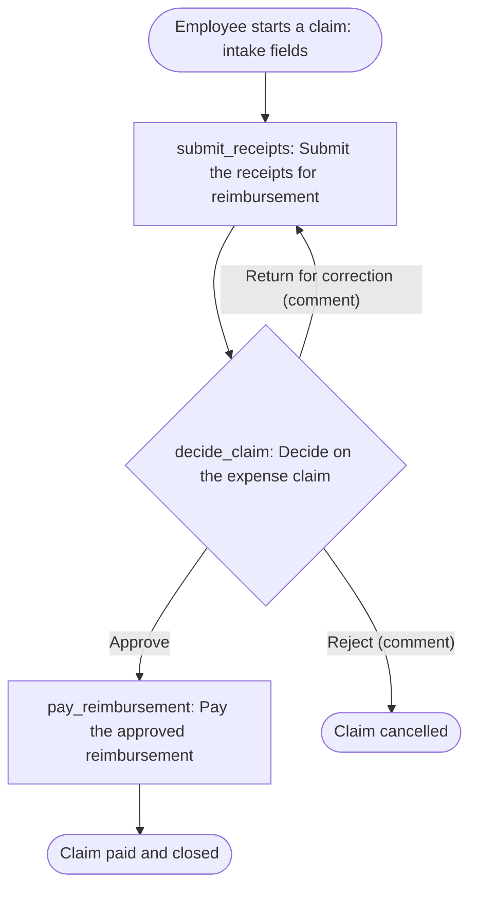

# Expense reimbursement: workflow design

Project `expense-reimbursement` · Angola · en · Africa/Luanda · AOA. Source: the customer checklist `checklist-expense` (three items). Product references: `references/provia-capabilities.md`, `references/workflow-yaml.md`, `references/action-writing.md`, `references/workflow-access.md`, contract revision `fed8efaf019abc901cb2b229f3676dc4031126fa`.

What is confirmed by the source is marked **source**; everything else is a **recommendation** or an **open decision** (D-numbers refer to `decisions[]` in `provia-project.json`).

## 1. Source step classification

| Source | Text | Classification | Reason | Target |
| --- | --- | --- | --- | --- |
| checklist-expense §a | «employee submits receipts» | `intake` | The claim details (purpose, category, date, amount, manager) are collected when the case is created | Case fields; intake form `expense-claim-intake` |
| checklist-expense §a | «employee submits receipts» | `action` | Attaching and confirming the receipts is observable work by one owner with evidence; it is also the return target when the manager sends the claim back | `submit_receipts` (creator) |
| checklist-expense §b | «manager approves» | `decision` | An authorized person chooses an outcome | `decide_claim` (`field:line_manager`, fallback `line_managers`) |
| checklist-expense §c | «finance pays» | `action` | Payment execution with payment evidence | `pay_reimbursement` (`finance`) |
| checklist-expense §c | «within the month» | folded into `pay_reimbursement` as `dueInSource` | A calendar-month deadline; the product `due` model (days after activation) cannot express it | `pay_reimbursement.dueInSource`, decision D2 |
| — (absent) | rejection / correction path | recommendation | The checklist has no rejection path; three outcomes are proposed | `decide_claim` branches, decision D7 |
| — (absent) | limits / thresholds | open decision | No policy on limits; no threshold is encoded | decision D3 |
| — (absent) | service levels | open decision | No `due` is set on human actions | decision D6 |
| — (absent) | org chart | open decision | Manager chosen per case; Finance membership unknown | decisions D4, D5, D14 |

Nothing in the source was dropped.

## 2. Action table

| localId | Name | Type | assigneeRef | Task + evidence (summary) | due | sourceRefs |
| --- | --- | --- | --- | --- | --- | --- |
| `submit_receipts` | Submit the receipts for reimbursement | standard | `creator` | Attach legible receipts in `receipts`; `amount_claimed` equals the receipt total | open decision D6 | §a |
| `decide_claim` | Decide on the expense claim | decision | `field:line_manager`, fallback `line_managers` (role) | Check receipts against the claim; fill `amount_approved`; branches **Approve** → continue, **Return for correction** → `return_to_action: submit_receipts` (comment required), **Reject** → `cancel_incident` (comment required) | open decision D6 | §b |
| `pay_reimbursement` | Pay the approved reimbursement | standard | `finance` (team) | Pay the approved amount; fill `payment_date`, `payment_reference`; attach proof of payment | `dueInSource`: «finance pays within the month» (calendar_day); D2 | §c |

The full five-part descriptions are in `workflow.yaml` and are the briefs the assignees read.

Case fields: `expense_description` (text), `expense_category` (select, proposed list D13), `expense_date` (date), `amount_claimed` (currency, Kz), `line_manager` (user), `receipts` (file) at creation; `amount_approved` (currency) set by the manager; `payment_date` (date) and `payment_reference` (text) set by Finance.

## 3. Flow

## 4. Owners, groups and access

| Group key | Name | Kind | Area | Owns | Flags |
| --- | --- | --- | --- | --- | --- |
| `line_managers` | Line managers | role | management | fallback for `decide_claim` | unnamed (D4), segregation (D14) |
| `finance` | Finance | team | finance | `pay_reimbursement` | unnamed (D5) |

The requester is the case creator (`creator`), not a group. No emails were supplied; no member is verified.

Access (`workflows[].access`): `organization` → `create_incident` (any employee submits, §a). Sensitivity `internal`. No `view` grant to Finance or to the managers: they see the cases that carry their actions; a shared Finance queue would need a `view` grant showing every case (D8). No `edit` grant because the source names no design owner (D1). No manual-trigger allowlist: the source does not restrict who may start below the `create_incident` holders.

## 5. Information model

No entity type is proposed. The claim is a case, the receipts are files on the case, the employee is the case creator (a user), the manager is a `user` field, and the payment facts are case metadata. `entityRequests[]` was reviewed and is empty; `entityTypes[]` is empty (D11). Employee bank details are held outside Provia (D9).

## 6. Rollout notes

- Pilot with one team and one month of claims; Finance and the managers each complete one claim end to end before opening to the organization.
- Training exercises: an employee starts a claim and attaches two receipts; a manager returns a claim for correction and then approves it; Finance records a payment with date, reference and proof.
- Measure: claims paid with `payment_date` inside the month of approval; claims returned for correction and the reasons; decisions without an assigned manager (fallback used).
- Support: the process owner (D1) answers policy questions; the implementer handles assignment and form issues during the pilot.
