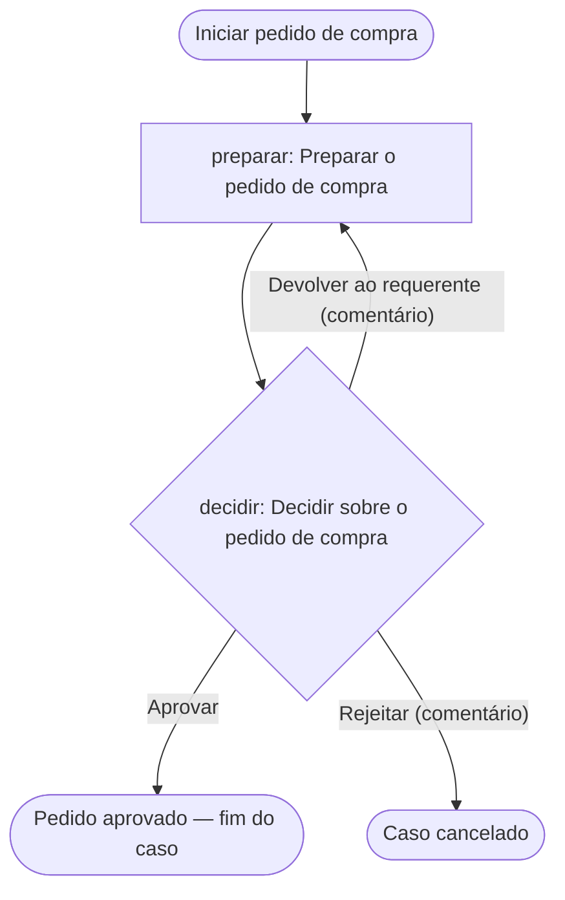

# Desenho do workflow «Pedido de compra» (`compras`)

Projecto `compras` · Angola · pt-AO · Africa/Luanda · AOA. Manifesto: `../provia-project.json`. Contrato Provia `provia.ao/v1`, revisão `fed8efaf019abc901cb2b229f3676dc4031126fa`.

Fontes fornecidas (texto integral do que foi entregue):

- **Documento A** — Procedimento de compras (2024), `doc-a-procedimento-compras-2024` §aprovacao: «a chefia do departamento aprova todos os pedidos».
- **Documento B** — Circular da direcção (2026), `doc-b-circular-direccao-2026` §aprovacao: «a partir de Janeiro só o director financeiro aprova pedidos».

Não existe mais informação. Tudo o que vai além destas duas frases está marcado como **presunção** ou **recomendação**.

## 1. Classificação dos passos das fontes

| Fonte / secção | Texto | Classificação | Razão | Acção |
| --- | --- | --- | --- | --- |
| A §aprovacao | «todos os pedidos» | `intake` | A regra pressupõe um pedido feito por alguém; os dados do pedido são recolhidos antes da decisão (formulário `pedido-compra` e campos do caso). | trigger + `preparar` |
| A §aprovacao | «a chefia do departamento aprova» | `decision` | Uma pessoa autorizada escolhe entre resultados. | `decidir` |
| A §aprovacao | «a chefia do departamento» (quem) | `conflict` | O Documento B atribui a mesma aprovação a outra pessoa. Ambos os actores mantêm-se no registo de grupos; nenhum foi escolhido. | `decidir` (sem `assigneeRef`) → D1 |
| B §aprovacao | «só o director financeiro aprova pedidos» | `decision` | Mesma decisão, outra autoridade. | `decidir` |
| B §aprovacao | «só o director financeiro» (quem) | `conflict` | Contradiz o Documento A. | `decidir` (sem `assigneeRef`) → D1 |
| B §aprovacao | «a partir de Janeiro» | `out_of_scope` | Data de vigência; não é um passo. Presume-se Janeiro de 2026 (circular de 2026); confirmar em D1(b). O Provia não muda de aprovador por data — a resolução de D1 fixa um responsável. | — |
| — (recomendação) | Devolução ao requerente para correcção | `decision` (ramo) | As fontes não prevêem correcções; sem este ramo, um pedido incompleto só pode ser rejeitado. | `decidir` → «Devolver ao requerente» |
| — (recomendação) | Rejeição com motivo | `decision` (ramo) | As fontes só dizem «aprova»; um pedido que não deve avançar precisa de um fim registado. | `decidir` → «Rejeitar» |
| — (não modelado) | Execução da compra, recepção, pagamento, comunicação da rejeição | `out_of_scope` | Não constam das fontes. Registado em D3; não foi acrescentada nenhuma acção. | — |

## 2. Tabela de acções

| localId | Nome | Tipo | `assigneeRef` | Tarefa + evidência | `due` | Fontes |
| --- | --- | --- | --- | --- | --- | --- |
| `preparar` | Preparar o pedido de compra | standard | `creator` | Completar descrição, montante (Kz) e justificação; anexar proposta quando existir. Evidência: campos obrigatórios preenchidos, ficheiro anexado. Recebe as devoluções. | — (D2) | A §aprovacao (implícito em «pedidos») |
| `decidir` | Decidir sobre o pedido de compra | decision | **não definido** (`unresolvedActors: aprovador_pedido`) | Aprovar / Devolver ao requerente / Rejeitar. Evidência: decisão registada; comentário obrigatório em «Devolver» e «Rejeitar» (recomendação). Ramos: Aprovar → `continue`; Devolver ao requerente → `return_to_action: preparar`; Rejeitar → `cancel_incident`. | — (D2) | A §aprovacao, B §aprovacao |

Actores com grupo proposto (ver `groups[]`): `chefias_departamento` (papel, Documento A), `director_financeiro` (equipa de uma pessoa, Documento B). Nenhum dos dois é atribuído a `decidir` até D1.

Campos do caso: `purchase_description` (texto, obrigatório), `purchase_amount` (moeda AOA, obrigatório), `needed_by` (data), `justification` (texto formatado, obrigatório). Entidade associada ao caso: **Departamento** (obrigatória).

## 3. Fluxo

## 4. Acesso

| Destinatário | Nível | Razão | Estado |
| --- | --- | --- | --- |
| `organization` | `create_incident` | Presunção a partir de «todos os pedidos» (A): qualquer colaborador abre um pedido para o seu departamento (D5). | proposto |

Sensibilidade `internal` (nenhuma fonte usa termos de confidencialidade). Sem concessão `view` a equipas executantes: os aprovadores vêem os casos que lhes são atribuídos. Dono do desenho (`edit`) por definir (D4). Sem restrição de arranque manual.

## 5. Ficheiros

- `workflow.yaml` — YAML portátil com secção `access` (gerada por `emit-workflow-access.mjs`).
- `validation.json` — saída exacta de `validate-workflow.mjs`: `valid: true`, 0 erros, 0 avisos, 2 itens de configuração (`assignment_missing` em `decidir`, `entity_reference`).
- `review-actions.json` — saída exacta de `review-actions.mjs`: 2/2 acções com as cinco partes, 0 fugas, `due` em falta em ambas.
- `editorial-review.md` — revisão editorial dos nomes e descrições.
- `setup.md` — entrega de configuração gerada do manifesto.

Validade estrutural não é correcção do negócio: a autoridade de aprovação (D1) é uma decisão da Direcção, não do validador.
