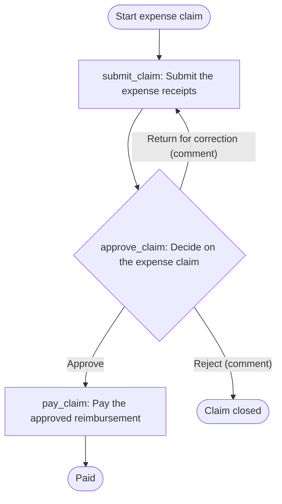

# Expense reimbursement — workflow design

Project `expense-reimbursement` · Angola · en · Africa/Luanda · AOA. Source: `checklist-reimbursement` (three-item checklist supplied in chat, 2026-09-21). Manifest: `../provia-project.json`. Contract revision `fed8efaf019abc901cb2b229f3676dc4031126fa` (provia-skills 1.2.0).

What was supplied: the checklist. What was not: an org chart, service levels, a policy on limits, a process owner, a customer name. Every gap is an open decision in `decisions[]` with an owner; nothing below was filled in from assumptions without saying so.

## 1. Source step classification

| Source | Text | Classification | Reason | Target |
| --- | --- | --- | --- | --- |
| checklist-reimbursement §a | "employee submits receipts" | `action` | Observable work by one owner (the claimant) with evidence (the receipts) | `submit_claim` |
| checklist-reimbursement §a | (implicit) data collected before the case exists: amount, period, purpose, manager, receipts | `intake` | Values the manager needs to decide; collected by the intake form when self-service is configured, otherwise in `submit_claim` | form `expense-claim-intake` |
| checklist-reimbursement §a | (implicit) hand-off to the manager | `folded` | Sequencing activates the approval; no separate hand-off step | `submit_claim` (folded) |
| checklist-reimbursement §b | "manager approves" | `decision` | An authorised person chooses an outcome; the checklist names one outcome, the design proposes three (D8) | `approve_claim` |
| checklist-reimbursement §b | (implicit) employee is told the outcome | `folded` | The creator sees the case; no notification action emitted | `approve_claim` (folded) |
| checklist-reimbursement §c | "finance pays within the month" | `action` | Observable work by Finance with evidence (proof of payment); the deadline is kept in `dueInSource` (D5) | `pay_claim` |

Nothing in the source was dropped. No `conflict` rows: a single source cannot disagree with itself. No `out_of_scope` rows.

## 2. Action table

| localId | Name | Type | Owner (`assigneeRef`) | Task + evidence | `due` | Source |
| --- | --- | --- | --- | --- | --- | --- |
| `submit_claim` | Submit the expense receipts | standard | `creator` | Compile a complete claim: receipts attached; `claim_amount`, `expense_period`, `expense_category`, `business_purpose`, `receipt_count`, `manager` filled. Return target for corrections. | unset — open decision D4 | §a |
| `approve_claim` | Decide on the expense claim | decision | `field:manager` (design intent), fallback `line_managers` (role group) | Check receipts against amount, period and purpose; apply the policy in force. Branches: **Approve** → continue; **Return for correction** → `return_to_action: submit_claim`, comment required; **Reject** → `cancel_incident`, comment required. | unset — open decision D4 | §b |
| `pay_claim` | Pay the approved reimbursement | standard | `finance` | Pay from the system of record's payment details; fill `paid_amount`, `payment_date`, `payment_reference`; attach proof of payment. | unset; `dueInSource` "Finance pays within the month" (calendar_day) — open decision D5 | §c |

Confirmed from the source: three steps, three actors, the order a → b → c, and the phrase "within the month". Recommendations (not in the source): the Return/Reject branches, the mandatory comment on both, the expense categories list, the `manager` user field as the routing mechanism, the evidence proposed for each action, and the proof-of-payment attachment. Unresolved: everything in D1–D10.

Why `field:manager` and not a managers group: the checklist says "manager", which in an expense process means the claimant's own manager. Provia cannot route an action to "the requester's manager"; the closest executable design is a `user` field the claimant fills, with a `role` group as the fallback owner the YAML can carry. `--check` accepts it because the intake form and `submit_claim` (`setsFields`) fill `manager` before the decision runs. Until receipts exist, `setup.md` lists the action as "owner set manually per case".

Why no group for the employee: the claimant is whoever starts the case (`requester` flag in the groups design) — `assigneeRef: creator`.

## 3. Flow

## 4. Access

| Grantee | Level | Reason | Source |
| --- | --- | --- | --- |
| `organization` | `create_incident` | "Employee submits receipts" — read as any employee may open a claim for their own expenses | §a |

Sensitivity `internal` (the source uses no word such as confidential or restricted). No `edit` grant: no process owner is named (D1). No `view` grant to Finance or Line managers: assignees see the cases that carry their actions; whether Finance needs every claim for the payment run is D7 (recorded in `accessReview[]`). No manual-trigger allowlist: nothing in the source restricts starts below the organization. `ownerArea: finance` is an assumption (expense reimbursement is usually finance-owned) to be confirmed with D1.

## 5. Information model

No entity types are proposed. Reasoning per `references/entity-design.md`:

| Candidate | Decision | Reason |
| --- | --- | --- |
| Employee (claimant) | not an entity | The claimant is the native case creator (a Provia user). Bank details are the only attribute the process would need and they belong in the payroll or accounting system of record (D6); storing them in Provia would create a second register with no update owner. |
| Expense claim | case, not entity | One claim is one incident; amount, period, category and payment evidence are case metadata and files. |
| Expense category | select, not entity | A governed vocabulary with no lifecycle of its own; `expense_category` select on the workflow. |
| Supplier / merchant on the receipt | not modelled | No process step selects or evaluates the merchant; the receipt file carries it. |

`entityRequests[]` is empty and `entityTypes[]` is empty, so no `catalogue.json` was produced (the catalogue format requires at least one type). If D6 answers that Finance needs bank details inside Provia, `provia-information-model` should design an Employee type with restricted access before any field is added.

## 6. Forms

One intake form, `expense-claim-intake` (kind `trigger`), specified in `forms[]` of the manifest: seven fields, six mapped to case fields, one file upload (receipts, PDF/JPG/PNG), internal respondents only, a confirmation text that promises no deadline the customer has not set, and three test steps. Forms are not carried by YAML: create and link it in Provia. No Form Fill action was designed; the payment evidence is recorded in case fields and a file on `pay_claim`, which keeps the package to one nonportable object.

## 7. Groups and rollout

| Key | Name | Kind | Area | Flags | Owns |
| --- | --- | --- | --- | --- | --- |
| `line_managers` | Line managers | role | management | `unnamed`, `segregation` | fallback of `approve_claim` |
| `finance` | Finance | team | finance | `unnamed` | `pay_claim` |

Members are unknown (no org chart). Rollout recommendation, to be confirmed once D1–D3 are answered: pilot with one department and its manager plus one Finance officer for one payment month; exercises: an employee starts a claim from the form, the manager returns it once and then approves, Finance pays and attaches the proof; review after the first month the claims with missing receipts, decisions older than the agreed service level and payments after month-end. Support: the process owner (D1) for questions on policy, the implementer for Provia configuration during the pilot.

## 8. Checks run

| Check | File | Result |
| --- | --- | --- |
| `scripts/emit-workflow-access.mjs` | `workflow.yaml` | 1 grant written (`organization` → `create_incident`), engine carries access inside the YAML |
| `scripts/review-actions.mjs` | `workflow.yaml` → `review-actions.json` | 3/3 actions complete, 0 leaks, `due` missing on 3 (by design, D4/D5) |
| `scripts/validate-workflow.mjs` | `workflow.yaml` → `validation.json` | `valid: true`, 0 errors, 0 warnings, backend schema validation passed, destination validation not run, 2 `assignment_missing` setup items, `readyToPublish: false` |
| `scripts/build-project-map.mjs --check` | `provia-project.json` | 0 errors, 0 warnings, 2 infos (assigned groups without a grant, rule 4), 0 readiness blocks, 23 pending items |
| `scripts/build-project-map.mjs --output` / `--setup` | `project.html`, `setup.md` | written |

Structural validity is not business correctness. Publication readiness is decided in Provia by an authorised person after the open decisions are answered.
