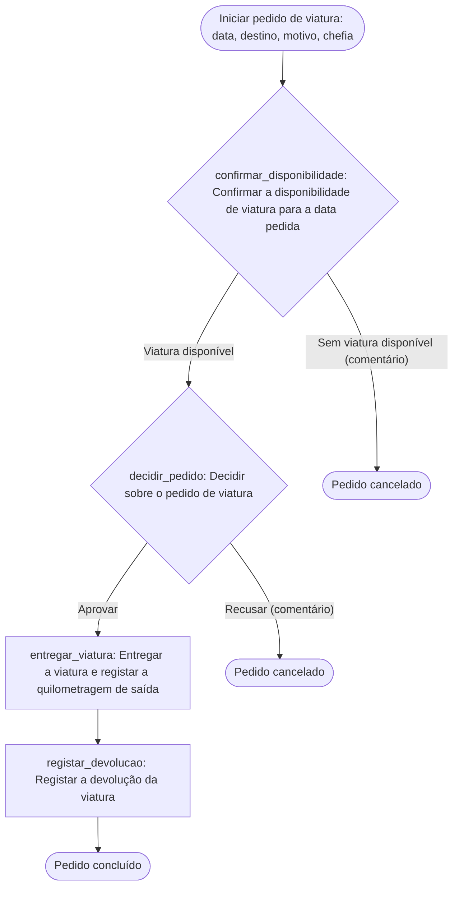

# Pedido de viatura — desenho do workflow

Fonte: `proc-viaturas-v2` (Procedimento de pedidos de viatura, v2, em vigor desde 2026-03-01) e `organigrama` (Secretariado 2, chefias de departamento 5, Direcção-Geral 1). País: Angola; fuso Africa/Luanda. Manifesto: `../provia-project.json`, workflow `pedido_viatura`, prefixo `VIAT`.

Legenda: **facto** = está escrito na fonte; **recomendação** = proposta do desenho; **decisão** = pergunta em aberto em `decisions[]`.

## 1. Classificação dos passos da fonte

| Fonte / secção | Texto (resumo) | Classificação | Razão | Acção destino |
| --- | --- | --- | --- | --- |
| proc-viaturas-v2 §1 | «O colaborador pede a viatura ao secretariado indicando data, destino e motivo» | `intake` | Dados recolhidos antes de o caso existir; o colaborador abre o pedido com os quatro campos (data, destino, motivo e a sua chefia) | Gatilho manual «Iniciar pedido de viatura» + formulário de entrada `pedido-viatura` |
| proc-viaturas-v2 §2 | «O secretariado verifica a disponibilidade no mapa de viaturas» | `decision` | A verificação tem dois desfechos observáveis (há viatura / não há); a fonte não diz o que acontece sem viatura, por isso o desfecho negativo é uma decisão registada (D2) | `confirmar_disponibilidade` |
| proc-viaturas-v2 §2 | «… e regista o pedido» | `folded` | O registo é o próprio caso no Provia; o Secretariado completa-o com a viatura reservada | `confirmar_disponibilidade` (Como, passo 3) |
| proc-viaturas-v2 §3 | «A chefia do colaborador aprova ou recusa o pedido no prazo de um dia útil» | `decision` | Pessoa autorizada escolhe entre Aprovar e Recusar; prazo de 1 dia útil expresso em `due` | `decidir_pedido` |
| proc-viaturas-v2 §4 | «O secretariado entrega a chave e o cartão de combustível» | `folded` | Sub-passos da mesma pessoa na entrega | `entregar_viatura` (Como, passo 3) |
| proc-viaturas-v2 §4 | «… e regista a quilometragem de saída» | `action` | Unidade de trabalho com evidência (campo «Quilometragem de saída») | `entregar_viatura` |
| proc-viaturas-v2 §5 | «O colaborador devolve a viatura» | `folded` | Entrega física que desencadeia a acção do Secretariado; não é uma acção do colaborador no sistema | `registar_devolucao` (Como, passo 1) |
| proc-viaturas-v2 §5 | «… o secretariado regista a quilometragem de entrada e eventuais danos» | `action` | Unidade de trabalho com evidência (quilometragem de entrada, danos, fotografias) | `registar_devolucao` |
| proc-viaturas-v2 §5 | Seguimento dos danos registados | `out_of_scope` | O procedimento termina no registo; o tratamento dos danos não está descrito (D6) | — |
| organigrama / direccao_geral | Direcção-Geral (1) | `out_of_scope` | Nenhum passo da v2 lhe é atribuído; proposta como chefia das chefias e dona do processo (D3, D4) | grupo `direccao_geral` (kind `role`) |

Nenhum passo da fonte foi omitido sem linha.

## 2. Tabela de acções

| localId | Nome | Tipo | `assigneeRef` | Tarefa + evidência (resumo) | `due` | Fonte |
| --- | --- | --- | --- | --- | --- | --- |
| `confirmar_disponibilidade` | Confirmar a disponibilidade de viatura para a data pedida | decision | `secretariado` | Consultar o mapa, reservar a viatura e preenchê-la no campo «Viatura»; comentário obrigatório se não houver viatura. Ramos: «Viatura disponível» → continue; «Sem viatura disponível» → cancel_incident (comentário) | vazio — decisão D1 | §2 |
| `decidir_pedido` | Decidir sobre o pedido de viatura | decision | `field:chefia_colaborador`, substituto `chefias` | Aprovar ou recusar o pedido do colaborador do seu departamento; comentário obrigatório em «Recusar». Ramos: «Aprovar» → continue; «Recusar» → cancel_incident (comentário) | 1 dia útil após activação (facto, §3) | §3 |
| `entregar_viatura` | Entregar a viatura e registar a quilometragem de saída | standard | `secretariado` | Ler o conta-quilómetros, entregar chave e cartão; campos «Quilometragem de saída» e «Cartão de combustível» + comentário com data/hora | `dueInSource`: até à data de utilização do pedido (relativo a um campo; o contrato não o exprime) | §4 |
| `registar_devolucao` | Registar a devolução da viatura | standard | `secretariado` | Receber chave e cartão, registar «Quilometragem de entrada», danos e fotografias, actualizar o registo da viatura | vazio — decisão D1 | §5 |

Notas de desenho:

- **`field:chefia_colaborador` é intenção, não atribuição executável** (referência: `project-manifest.md`). O produto não atribui a partir de um campo; o YAML e a configuração levam o grupo `chefias`, e a descrição instrui a chefia errada a reatribuir. Alternativa (recomendação para o cliente): um grupo por departamento, se os departamentos forem nomeados.
- Os dois resultados de recusa cancelam o pedido, como a fonte prevê. Um resultado «Devolver para correcção» é a decisão D7 e exigiria uma acção inicial do criador como alvo de retorno.
- Sem prazos para o Secretariado na fonte: `due` fica vazio (D1); nenhum prazo foi inventado.
- Não há modelos de documento citados (`templates[]` vazio); não há actores nem tipos de entidade sem chave (`unresolvedActors[]`, `unresolvedEntityTypes[]` vazios).

## 3. Fluxo

## 4. Campos do caso

| Campo | Tipo | Obrigatório | Preenchido por | Fonte |
| --- | --- | --- | --- | --- |
| `data_utilizacao` | date | sim | colaborador, na abertura | §1 (facto) |
| `destino` | text | sim | colaborador, na abertura | §1 (facto) |
| `motivo` | text (várias linhas) | sim | colaborador, na abertura | §1 (facto) |
| `chefia_colaborador` | user | sim | colaborador, na abertura | §3 (recomendação: torna explícita «a chefia do colaborador») |
| `viatura` | entity → Viatura | não | Secretariado, `confirmar_disponibilidade` | §2 (recomendação) |
| `cartao_combustivel` | text | não | Secretariado, `entregar_viatura` | §4 (facto) |
| `km_saida` | number | não | Secretariado, `entregar_viatura` | §4 (facto) |
| `km_entrada` | number | não | Secretariado, `registar_devolucao` | §5 (facto) |
| `danos_registados` | boolean | não | Secretariado, `registar_devolucao` | §5 (facto) |
| `descricao_danos` | text (várias linhas) | não | Secretariado, `registar_devolucao` | §5 (facto) |

## 5. Acesso

| Destinatário | Nível | Razão | Fonte |
| --- | --- | --- | --- |
| `organization` | `create_incident` | Qualquer colaborador abre o pedido | §1 |
| `group:secretariado` | — | Responsável pela primeira acção de todos os pedidos; vê-os por atribuição, sem `view` (regra 4 de `workflow-access.md`) | §2 |
| `group:chefias` | — | Vê os pedidos em que decide | §3 |
| (dono do desenho) | `edit` | **Não atribuído**: a fonte não nomeia o dono do processo (D3) | — |

Sensibilidade `internal` (a fonte não usa «confidencial» ou «restrito»). Sem lista de permitidos no gatilho manual: quem pode abrir é toda a organização, não há restrição abaixo disso.

## 6. Grupos derivados das fontes

| Chave | Nome (único no tenant) | Tipo | Área | Membros propostos | Sinalizações |
| --- | --- | --- | --- | --- | --- |
| `secretariado` | Secretariado | team | apoio_administrativo | 2 técnicos/as (organigrama) | — |
| `chefias` | Chefias de departamento | team | departamentos | 5 chefes de departamento (organigrama; departamentos não nomeados) | `segregation` (D4) |
| `direccao_geral` | Direcção-Geral | role | direccao | 1 pessoa | `single_person` (D4); não é responsável por nenhuma acção da v2 (aviso do `--check`, esperado) |

Nenhum email foi fornecido nas fontes; nenhum foi inventado.

## 7. Formulário de entrada

`pedido-viatura` (kind `trigger`): quatro perguntas mapeadas 1:1 para `data_utilizacao`, `destino`, `motivo` e `chefia_colaborador`; respondentes internos com sessão iniciada; sem anexos; confirmação que anuncia a verificação do Secretariado e o prazo de um dia útil da chefia. Especificação completa em `forms[]` do manifesto. O formulário não é transportado pelo YAML: cria-se e liga-se no Provia (ou em modo ligado com `form_upsert`). Não há acções Form Fill neste procedimento.

## 8. O que foi verificado e o que falta

- Verificado: `validate-workflow.mjs` (válido, 0 erros, 0 avisos, 4 itens de configuração «assignment_missing»), `review-actions.mjs` (4/4 acções com as cinco partes, 0 fugas de notas de implementação), `build-project-map.mjs --check` (0 erros, 1 aviso esperado, 2 informações, 0 bloqueios de prontidão).
- Não verificado: validação no destino (pré-visualização de importação), existência do tipo Viatura e dos grupos no tenant, comportamento do campo `entity` sem tipo associado até à configuração manual, publicação. Nada foi criado no Provia.
