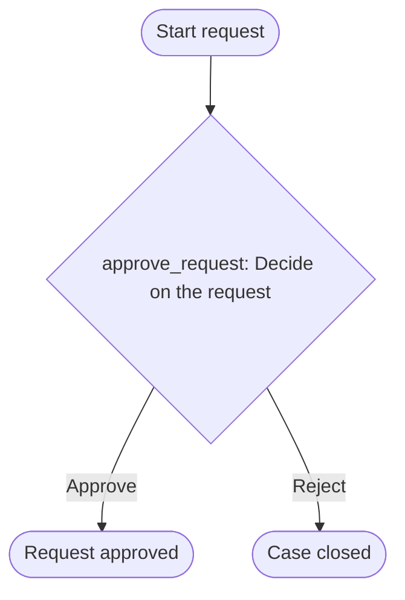

All artefacts are generated and validated. Now let me present the design deliverable in chat.

## Source step classification

Only two fragments were supplied — sections 1, 3–6 of the SOP were not given, and there is no description of what precedes or follows the approval.

| Source | Section | Text (as supplied) | Classification | Reason | Target action |
|---|---|---|---|---|---|
| sop | 2 | "Department manager approves" | **conflict** | Names an approver for the request; section 7 names a different, explicitly exclusive approver for what reads as the same approval requirement, and nothing in the supplied text distinguishes two separate gates | `approve_request` |
| sop | 7 | "Only the finance director approves" | **conflict** | The word "only" makes this exclusive, contradicting §2's approver. Whether §2 and §7 describe the same decision or two different stages in the missing sections 3–6 cannot be determined from the text given | `approve_request` |

No text was supplied for an intake step, a rejection/return path, evidence, or a service level — these are not classified because there is nothing in the source to classify; they're carried as open decisions below instead of invented.

## Action table

| localId | Name | Type | assigneeRef | Evidence | Due | sourceRefs |
|---|---|---|---|---|---|---|
| `approve_request` | Decide on the request | Decision | *unresolved — see D1* | Comment on rejection (proposed, not stated in source) | Not set (D2) | §2, §7 |

Branches: **Approve** → `continue`; **Reject** → `cancel_incident` (proposed only — D4).

Two candidate groups were proposed since both actors are named in the text, but neither is wired to the action until D1 is answered: `department_managers` (§2) and `finance_director` (§7).

## Flow diagram



## YAML skeleton

Written to `workflow.yaml` — a manual trigger (no intake data was supplied), one Decision action with `assignee` intentionally omitted, and the two branches above. Not validated or packaged; that's `provia-workflow-package`'s job.

## Manifest entry

Written to `provia-project.json`, plus the rendered map (`project.html`) and handover (`setup.md`). `build-project-map.mjs --check` passes (0 errors), with 3 expected warnings: the action has no owner and both candidate groups own nothing — all downstream of the same unresolved conflict.

## Open decisions (answer before packaging)

- **D1** — §2 assigns approval to the department manager; §7 says only the finance director approves. Is this one contradictory gate, or two distinct gates from the missing sections 3–6? Who actually approves, and in what order if both?
- **D2** — No service level stated; what's the expected turnaround?
- **D3** — Nothing describes what starts the case (who submits what) or what happens after approval/rejection.
- **D4** — No rejection/return path stated; the "Reject → close case" branch is a placeholder recommendation, not a sourced requirement.

I deliberately did not guess an approver — that would silently overwrite one authority with another in a live approval workflow.

Next recommended step: `provia-organization-rollout`, to resolve D1 (who actually holds approval authority) and complete the `department_managers`/`finance_director` groups — that decision blocks everything else, including packaging. Copyable request:

```text
Use provia-organization-rollout with provia-project.json in this directory. Resolve decision D1 (conflicting approvers in SOP §2 vs §7 for action "approve_request" in workflow "approval-request") and complete the department_managers and finance_director groups.
```