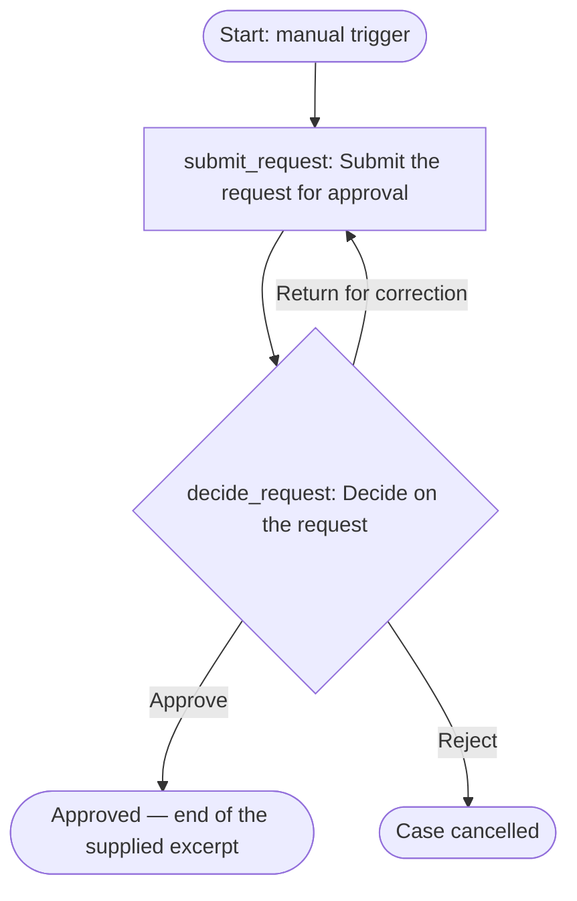

# Request approval — workflow design

Source: two sentences of an SOP supplied in chat (`sop`), sections 2 and 7. Nothing else was
available: no process subject, no criteria, no deadline, no evidence rule, no roles beyond the two
approvers, no intake data. Everything below separates what the source states, what this design
recommends, and what the process owner must decide.

**Assumptions stated and carried forward** (all recorded as open decisions):

- No country was supplied. Angola is used as a provisional starting context (language `en` as the
  user wrote in English, currency AOA, timezone Africa/Luanda) — D6.
- The excerpt describes one approval. It is modelled as one process whose case is a request; the
  requester's submission action and the rejection/return paths are recommendations, not source
  requirements — D7.
- The approver of the decision is left **unassigned**. Sections 2 and 7 conflict and this design
  does not choose between them — D1.

## 1. Source step classification

| Source | Section | Text | Classification | Reason | Target action |
| --- | --- | --- | --- | --- | --- |
| `sop` | 2 | «department manager approves» | `conflict` | Section 7 gives the same approval to a different sole authority. Kept unresolved; no assignee derived from it. | `decide_request` |
| `sop` | 7 | «only the finance director approves» | `conflict` | The word "only" excludes the section 2 authority for the same approval. Kept unresolved. | `decide_request` |

Nothing else appears in the supplied text, so there are no further rows. Sections 1 and 3–6 of the
SOP were not supplied and are therefore neither classified nor assumed to be empty.

### Added by this design, not by the source (recommendations)

| Element | Why | Decision |
| --- | --- | --- |
| `submit_request` action | A decision needs a case with content to decide on; the excerpt has no start. | D7 |
| `Return for correction` and `Reject` branches | The excerpt gives no rejection or rework path; an approval-only decision cannot record a refusal. | D7 |
| Generic decision criteria in the brief | The excerpt names the authority but no criterion. | D2 |

## 2. Action table

| localId | Name | Type | `assigneeRef` | Task + evidence | `due` | `sourceRefs` |
| --- | --- | --- | --- | --- | --- | --- |
| `submit_request` | Submit the request for approval | standard | `creator` | Describe the request and attach supporting documents. Evidence: case comment with the request and its justification; documents attached. | unset — no service level in source (D4) | — (recommendation) |
| `decide_request` | Decide on the request | decision | **unresolved — D1** | Decide whether the request is approved. Evidence: comment stating the basis on approval; comment with the reason on return or rejection. | unset — no service level in source (D4) | `sop#2`, `sop#7` |

`decide_request` branches:

| Label | Outcome | Target | Comment required |
| --- | --- | --- | --- |
| Approve | `continue` | — | yes |
| Return for correction | `return_to_action` | `submit_request` | yes |
| Reject | `cancel_incident` | — | yes |

The full five-part briefs are in `workflow.yaml` and in the manifest, not repeated here.

### Proposed groups

| key | name | kind | Flags | Source |
| --- | --- | --- | --- | --- |
| `department_managers` | Department managers | team | `alias` — the excerpt gives no organizational name; confirm the one in use | `sop#2` |
| `finance_director` | Finance director | team | `single_person` — one office; the delegate during absence is D8 | `sop#7` |

Both groups are proposed so the two candidate authorities are visible for the D1 conversation.
Neither is assigned to an action, so `--check` reports each as owning nothing. That warning is the
intended state until D1 is answered; it must not be cleared by picking an approver.

## 3. Flow



The approver of `decide_request` is not shown because the source does not determine it. What
happens after an approval is also outside the supplied text: sections 3–6 and 8+ were not provided.

## 4. YAML skeleton

`workflow.yaml` in this directory: `provia.ao/v1` / `Workflow`, prefix `APRV`, a manual trigger,
`access.default: creator_only`, and both actions with their full five-part descriptions.
`decide_request` deliberately carries **no `assignee`**. This is a skeleton for
`provia-workflow-package`; the bundled YAML validator and the action review gate were **not run**
in this task.

## 5. Manifest

`provia-project.json` in this directory (`provia-project/v1.1`), with the workflow, its `access`
section, the two proposed groups and eight open decisions.

Check actually run, from the plugin root, against `provia-project.json`:

```
node scripts/build-project-map.mjs provia-project.json --check
```

Result: **0 errors, 3 warnings, 16 pending items**, access declared on 1/1 workflows, 0 readiness
blocks. The three warnings are `decide_request` has no owner, and each of the two candidate groups
owns no action — all three are the conflict, reported as designed.

## Open decisions before packaging

| id | Question | Owner |
| --- | --- | --- |
| D1 | **Who approves?** §2 says the department manager, §7 says only the finance director. Readings: (a) §7 replaces §2 for a subset the missing sections define, (b) §7 supersedes §2 entirely, (c) both approve in sequence. Does a threshold, category or risk level select between them? | Process owner |
| D2 | What criteria must the approver apply? | Process owner |
| D3 | Who may open a case, and which group owns the design? As designed, nobody but the creator and administrators can start one. | Process owner |
| D4 | What is the service level for the decision? | Process owner |
| D5 | What data must the requester supply? No fields and no intake form were designed. | Process owner |
| D6 | Country, language, currency, timezone — provisional, not supplied. | Process owner |
| D7 | Are the submission action and the return/rejection branches correct? They are this design's recommendations. | Process owner |
| D8 | Who decides when the finance director is absent, under readings (b) or (c)? | Process owner |

D1 is blocking: the workflow cannot be assigned, and should not be published, until it is answered.
D3 is blocking for import as-is.
