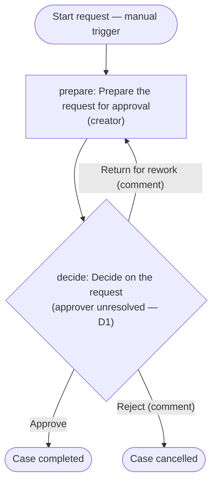

# Workflow design: Request approval (SOP sections 2 and 7)

Produced by `provia-workflow-designer` (provia-skills 1.2.0) on 2026-09-21, disconnected mode. No Provia organization was read or changed.

**Input received.** Two sentences, and nothing else: *SOP section 2: department manager approves. SOP section 7: only the finance director approves.* No process name, no start or end condition, no service level, no evidence requirement, no exception path, no country.

**Context assumptions.** Country not supplied: Angola is the provisional context (AOA, Africa/Luanda), per plugin convention; the reply language follows the request (English). Both are recorded as decision D8.

**The central finding.** The two sections name different approvers for what reads as the same approval, and section 7's «only» excludes the section 2 approver. Per the skill's rule for conflicting sections, the step is classified as `conflict`, the decision action is left **without an assignee**, and the choice is recorded as decision **D1** for the process owner. The designer did not pick either section. Every other element of the workflow below is scaffolding needed for a runnable approval and is marked as a recommendation.

---

## 1. Source step classification

| Source id | Section | Source text | Classification | Reason | Target action |
| --- | --- | --- | --- | --- | --- |
| S2 | sop §2 | «department manager approves» | `conflict` | An approval by an authorized person is a `decision`; but §7 names a different, exclusive approver for the same step. Kept unresolved (D1). | `decide` (assignee unresolved) |
| S7 | sop §7 | «only the finance director approves» | `conflict` | Same step, different and exclusive approver; contradicts §2. Kept unresolved (D1). | `decide` (assignee unresolved) |

Nothing else exists in the source, so nothing else was folded, automated or put out of scope.

**Design additions not present in the source (recommendations, not requirements):**

| Addition | Why | Decision |
| --- | --- | --- |
| Action `prepare` by the requester (`creator`) | An approval needs something to approve; a first action also gives the «Return for rework» branch a return target. | D2 |
| Fields `request_summary` (required) and `justification` | Minimum content the approver can decide on; the real intake is unknown. | D2 |
| Branches «Return for rework» and «Reject» on `decide` | The source has no rejection or rework path; a decision with only «Approve» cannot record a refusal. | D7 |
| Mandatory comment on «Return for rework» and «Reject» | The source names no evidence; an approval without evidence cannot prove it happened. | D7 |

## 2. Action table

| localId | Name | Type | assigneeRef | Task + evidence | due | sourceRefs |
| --- | --- | --- | --- | --- | --- | --- |
| `prepare` | Prepare the request for approval | standard | `creator` | Describe the request in `request_summary` and `justification`, attach supporting documents, complete to send for decision. Evidence: summary filled, documents attached. | unset — open decision D6 | none (recommendation, D2) |
| `decide` | Decide on the request | decision | **unresolved — conflict D1** (candidates: `department_managers` per §2, `finance_director` per §7) | Decide whether the request may proceed. Evidence: mandatory comment on «Return for rework» and «Reject». Branches: **Approve** → `continue`; **Return for rework** → `return_to_action: prepare` (comment required); **Reject** → `cancel_incident` (comment required). | unset — open decision D6 | sop §2, sop §7 |

Proposed groups (data in `provia-project.json`, to be completed by `provia-organization-rollout`):

| key | name | kind | flag | Source |
| --- | --- | --- | --- | --- |
| `department_managers` | Department managers | team | `unnamed` — which department manager (the requester's own, per case, or a fixed group)? See D4. | sop §2 |
| `finance_director` | Finance director | team | `single_person` — a group so ownership survives absences; delegate is D5. | sop §7 |

Neither group is assigned yet; `--check` reports both as owning no action, which is the expected consequence of D1 being open.

**How D1's resolution changes the design**

| Resolution | Change to this design |
| --- | --- |
| (a) §7 supersedes §2 | `decide.assigneeRef = finance_director`; nothing else changes. |
| (b) §2 applies; §7 is an error or another process | `decide.assigneeRef = department_managers` (and answer D4 on how the manager is identified). |
| (c) Both, in sequence | Split into two decisions: `decide_department` (department manager) then `decide_finance` (finance director), each with its own reject/return branches; re-run the designer. |
| (d) Different scopes (e.g. an amount band or category) | Add the scoping field to the case; one human decision applies the rule stated in its description. Provia does not route on amounts automatically, and no threshold may be invented. |

## 3. Flow diagram

## 4. YAML skeleton

Written to `workflow.yaml` (prefix `APR`, manual trigger, two fields, two actions, full five-part descriptions, decision branches). It is a skeleton for `provia-workflow-package`, which runs `validate-workflow.mjs`; **it has not been validated**. The `decide` action carries no `assignee` on purpose; the manifest's `assigneeRef` is empty until D1 is resolved.

## 5. Manifest entry

Written to `provia-project.json` (`provia-project/v1.1`): source `sop` with anchors `2` and `7`, the two proposed groups, workflow `request-approval` with its actions, `access` (`default: creator_only`, `sensitivity: internal`, note explaining both are placeholders pending D3), one manual trigger with an empty allowlist, `setupNotes`, and decisions D1–D8.

### Checks actually run

| Check | Command | Result |
| --- | --- | --- |
| Manifest check | `node scripts/build-project-map.mjs provia-project.json --check` | **0 errors, 3 warnings, 0 infos**: `decide` has no owner; `department_managers` owns no action; `finance_director` owns no action. All three are the direct consequence of D1 being open. 16 pending setup items, 0 readiness blocks, access declared 1/1. |
| Project map | `… --output project.html` | Written. |
| Setup handover | `… --setup setup.md` | Written (16 pending items, all manual-configuration placeholders). |
| Action review gate | `node scripts/review-actions.mjs workflow.yaml` | `valid: true`; 2/2 actions have all five parts, no implementer-note leaks; `due` missing on both (D6). Presence check only, not business correctness. |

Not run: `validate-workflow.mjs` (belongs to `provia-workflow-package`). No customer sign-off, no Provia import, no publication.

---

## Open decisions before packaging

| id | Question | Owner |
| --- | --- | --- |
| **D1** | Who approves: §2 department manager, §7 finance director, both in sequence, or each in a different scope? **Blocks assignment of `decide`.** | Process owner / SOP author |
| D2 | What is the request, what starts and ends a case; is the placeholder intake (`request_summary`, `justification`, `prepare`) right? | Process owner |
| D3 | Who may open a request (`create_incident`) and who owns the design (`edit`)? `creator_only` is a placeholder. | Process owner |
| D4 | If the department manager approves: the requester's own manager per case (`field:` assignee + fallback) or a fixed group? | Process owner |
| D5 | Delegate for the finance director's absence — §7 says «only», so a delegate changes the rule. | Finance director |
| D6 | Service level for `prepare` and `decide`; `due` unset until stated. | Process owner |
| D7 | Are «Reject» and «Return for rework» allowed, with a mandatory comment? | Process owner |
| D8 | Country, language, currency, timezone (Angola / en / AOA / Africa/Luanda are provisional). | Implementer |

## Next step

D1 is a question only the SOP's owner can answer; no further skill resolves it. Once answered, `provia-workflow-designer` re-run (for resolution c or d) or `provia-organization-rollout` (for a or b, to complete the two groups and the access matrix) is the next skill.
