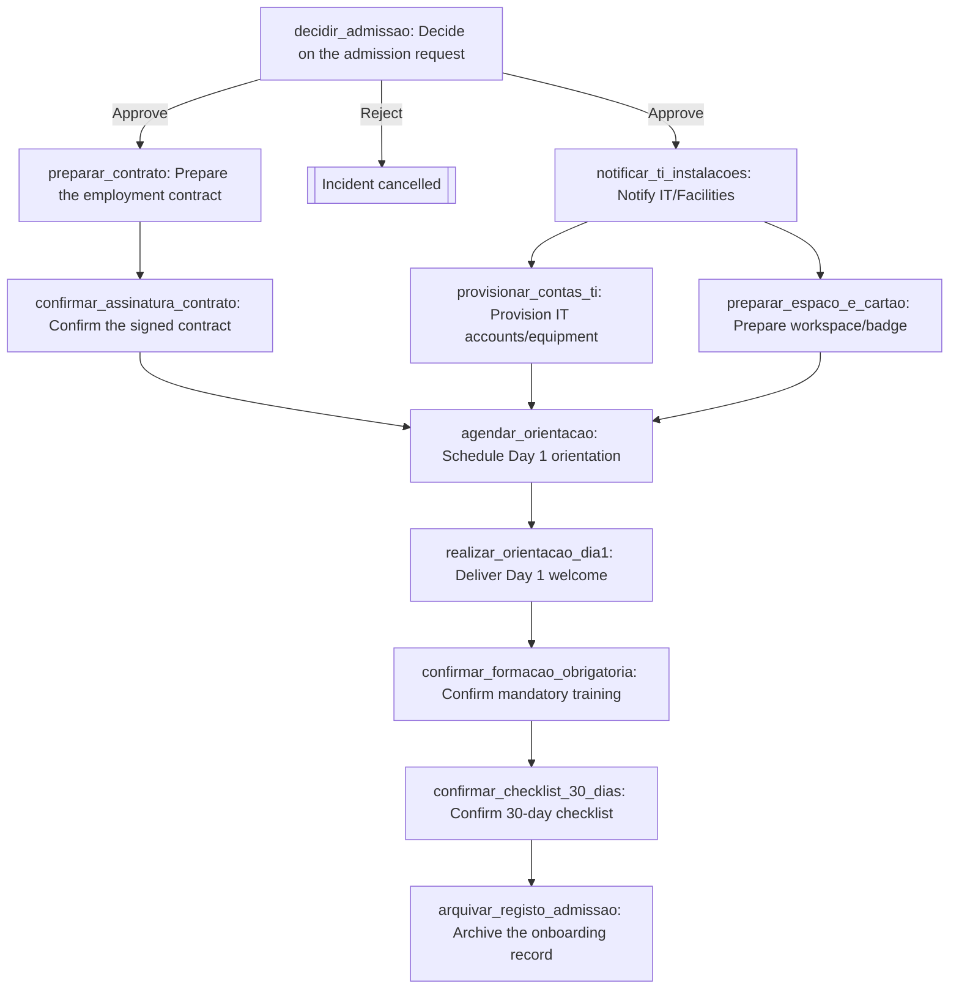

All artefacts written and the manifest checker passed. Here's the deliverable.

## Important: no SOP was actually supplied

Your message referenced "this onboarding SOP," but no document was attached and the working directory was empty. Since you asked me to state assumptions and continue, I **reconstructed a generic, illustrative onboarding SOP** (12 numbered steps: request → HR headcount check → contract → signature → IT/Facilities notified → accounts provisioned → workspace/badge → Day 1 orientation scheduled → Day 1 welcome → training → 30-day checklist → archive) and designed against that. **This is a stand-in, not your organization's real procedure** — treat everything below as a template to correct, not a finished design. This is recorded as open decision **D1** in `provia-project.json`.

## 1. Source step classification (of the reconstructed SOP)

| § | Text (short) | Class | Reason | Action |
|---|---|---|---|---|
| 1 | Manager submits request | intake | Case-starting data | trigger fields |
| 2 | HR checks completeness/headcount | decision | Authorized choice | `decidir_admissao` |
| 3 | HR prepares & sends contract | action | Observable unit, one owner | `preparar_contrato` |
| 4 | Candidate signs & returns | action | Evidence-bearing completion | `confirmar_assinatura_contrato` |
| 5 | HR informs IT/Facilities | automation | Pure hand-off, no judgment | `notificar_ti_instalacoes` |
| 6 | IT creates accounts/orders equipment | action | Observable, one owner | `provisionar_contas_ti` |
| 7 | Facilities prepares workspace/badge | action | Observable, one owner, independent of §6 | `preparar_espaco_e_cartao` |
| 8 | HR schedules orientation, assigns buddy | action | Buddy assignment folded as sub-step | `agendar_orientacao` |
| 9 | Manager welcomes, reviews plan | action | Observable, one owner | `realizar_orientacao_dia1` |
| 10 | New hire completes training | action | Evidence-bearing, owner reassigned to HR (see D7) | `confirmar_formacao_obrigatoria` |
| 11 | Manager confirms 30-day checklist | action | Stated service level (30 days) | `confirmar_checklist_30_dias` |
| 12 | HR closes/archives | action | Observable, one owner | `arquivar_registo_admissao` |

No rejection/return path, no SLAs (besides the 30-day mark), and no background-check step were stated — flagged as recommendations/gaps (D3, D4, D8), not silently invented.

## 2. Action table (owners by group key)

| localId | Name | Type | Owner | Evidence | Due |
|---|---|---|---|---|---|
| decidir_admissao | Decide on the admission request | decision | `recursos_humanos` | Comment w/ headcount ref | open (D4) |
| preparar_contrato | Prepare the employment contract | standard | `recursos_humanos` | Sent contract | open |
| confirmar_assinatura_contrato | Confirm the signed contract | standard | `recursos_humanos` | Signed contract | open |
| notificar_ti_instalacoes | Notify IT/Facilities | notification | automated | — | — |
| provisionar_contas_ti | Provision IT accounts/equipment | standard | `ti` | Account list, order confirmation | open |
| preparar_espaco_e_cartao | Prepare workspace/badge | standard | `instalacoes` | Badge/workspace confirmation | open |
| agendar_orientacao | Schedule Day 1 orientation | standard | `recursos_humanos` | Invite, buddy name | open |
| realizar_orientacao_dia1 | Deliver Day 1 welcome | standard | `creator` | Plan-reviewed comment | open |
| confirmar_formacao_obrigatoria | Confirm mandatory training | standard | `recursos_humanos` | Certificate | open (D7) |
| confirmar_checklist_30_dias | Confirm 30-day checklist | standard | `creator` | Review comment | 30 calendar days from activation (D6) |
| arquivar_registo_admissao | Archive the onboarding record | standard | `recursos_humanos` | Archiving comment | — |

`decidir_admissao` supports only **Approve** (continue) and **Reject** (cancel_incident) — there's no prior action for a "return" outcome to target, so a rejected request currently means starting over (D3).

## 3. Flow diagram



## 4–5. YAML skeleton and manifest

Written to the working directory:
- `workflow.yaml` — skeleton only; **not yet validated** (`provia-workflow-package` runs `validate-workflow.mjs` and `review-actions.mjs`).
- `provia-project.json` — manifest with sources, 3 proposed groups, the workflow, and 8 open decisions.
- `project.html`, `setup.md` — generated by `build-project-map.mjs --check/--output/--setup`. The check passed: **1 workflow, 3 groups, 0 warnings, 31 pending items** (all the unresolved organization references and open decisions you'd expect from a disconnected, placeholder design).

## Open decisions before packaging

- **D1** — No real SOP was supplied; confirm or replace this reconstructed process entirely.
- **D2** — Who confirms headcount/budget: HR alone or also Finance?
- **D3** — No return path for a rejected request; is "start a new case" acceptable?
- **D4** — No SLAs for contract signature, provisioning or training.
- **D5** — HR both prepares and confirms the contract (no segregation named).
- **D6** — 30-day due is measured from case activation, not the `start_date` field, since the contract's `due` only supports `activation`/`creation` as a basis — confirm this is acceptable given a gap between approval and actual start.
- **D7** — The new hire has no defined Provia access; contract-signing and training confirmation are currently HR-mediated about them, not steps they perform.
- **D8** — No background-check step is named.

## Next step

Recommended: **`provia-organization-rollout`**, to turn the three proposed groups (`recursos_humanos`, `ti`, `instalacoes`) into real membership/training/adoption plans, and to resolve D2/D5 (who holds budget and signature-verification authority). Alternatively, if you can supply the actual onboarding SOP now, re-running **`provia-workflow-designer`** on the real document (pointing at this `provia-project.json`) is more valuable than proceeding further on the placeholder.

Copyable request:
```text
Use provia-organization-rollout with provia-project.json in this directory. Complete the groups recursos_humanos, ti and instalacoes (members, training, adoption plan) and resolve decisions D2 and D5 about budget and contract-signature authority.
```