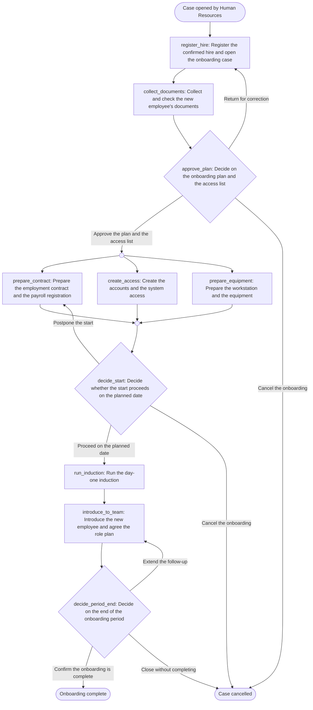

# Employee onboarding — Provia workflow design

Produced by `provia-workflow-designer` (provia-skills 1.2.1) on 2026-09-23.
Project key `onboarding` · prefix `ONB` · manifest `provia-project.json` · skeleton `workflow.yaml`.

## Read this first: what this design is, and is not

**No onboarding SOP was supplied.** The request named one ("this onboarding SOP") and stated that some required context is unavailable. The working directory was empty: no file, extract or quotation of the procedure exists in this session, and no project manifest existed to read. Nothing was read from a customer document.

So the design below is **not** a transcription of a procedure. It is a proposal built on a declared, generic onboarding baseline, produced so the customer has something concrete to correct rather than a blank page. Concretely:

| What I did | What I deliberately did not do |
| --- | --- |
| Named the three requirements the request itself establishes: actions, approvals, exception paths | Quote, paraphrase or cite any section of a document I have not seen |
| Proposed a ten-action flow from generic onboarding practice, labelled `assumed` in every row | Present any of it as the customer's procedure |
| Proposed owners as placeholder groups with `unnamed` flags | Invent the real team names, an org chart or any organization id |
| Left every `due` unset | Invent a deadline or a service level |
| Proposed a single approval authority and raised the second-approver question | Invent an approval threshold, an amount or a delegation rule |
| Set `sensitivity: internal` and recorded that it is unevidenced | Claim the source called onboarding confidential or restricted |

Eleven open decisions (D1–D11) carry every one of these gaps. **D1 is blocking**: the actual SOP must be supplied and reconciled against this design before it is packaged or published.

The session offered a `provia-implementer` MCP server, so connected mode was attempted: the `org_get_context` call was **not permitted**, and the tenant was never read. The design is therefore fully disconnected — no group, user, entity type or workflow was read from or written to Provia, and nothing was created there.

Country, jurisdiction and language were not supplied either. Following the plugin convention, Angola, `Africa/Luanda` and AOA are recorded as a **provisional** starting context, and the design is written in English because the request was. That is D11, not a finding about the customer.

---

## 1. Source step classification

### 1a. What the supplied request actually establishes

Source `request-brief` is the design request itself — the only text available. Its four anchors are the only requirements with any authority here.

| Source | Section | Source text | Classification | Reason | Target action |
| --- | --- | --- | --- | --- | --- |
| `request-brief` | `process` | "this onboarding SOP" | `out_of_scope` | Names a document that was not supplied. No content to classify. Raised as D1 and recorded as source `onboarding-sop` with no content and nothing citing it. | — |
| `request-brief` | `actions` | "Turn … into actions" | `action` | Establishes the deliverable: observable units of work with an owner and evidence. | All ten actions |
| `request-brief` | `approvals` | "… approvals …" | `decision` | Establishes that at least one authorized person must choose between outcomes. Who, and on what criteria, is not stated. | `approve_plan`, `decide_period_end` |
| `request-brief` | `exceptions` | "… exception paths" | `decision` | Establishes that rejection, rework and abandonment must be modelled, not left implicit. | `approve_plan`, `decide_start`, `decide_period_end` |
| `request-brief` | `process` | "Some required context is unavailable." | `conflict` | The request asks for a design from a document it also says is unavailable. Not silently resolved: the design proceeds on a declared assumed baseline, and D1 keeps the reconciliation open. | — |

### 1b. Assumed baseline inventory

Every row below is `assumed`: it comes from generic onboarding practice, **not** from a supplied source. Each is a proposal to confirm, correct or delete against the real SOP. The `Origin` column is uniform on purpose — it is the honest answer, and it is what D1 exists to change.

| # | Assumed step | Origin | Classification | Reason | Target action |
| --- | --- | --- | --- | --- | --- |
| A1 | Recruiting confirms the offer was accepted | assumed | `folded` | A hand-off into the process, not a unit of work owned inside it | `register_hire` |
| A2 | Record employee, role, team, start date and hiring manager | assumed | `action` | Observable work with evidence; establishes the case data every later action reads | `register_hire` |
| A3 | Notify the hiring manager that the case is open | assumed | `folded` | An "is informed" step, a sub-step of registration | `register_hire` |
| A4 | Send the document list to the new employee | assumed | `folded` | Sub-step of the collection task, same owner | `collect_documents` |
| A5 | Collect and check identity and contract documents | assumed | `action` | Observable work with attached evidence | `collect_documents` |
| A6 | Approve the onboarding plan and the access list | assumed | `decision` | An authorized person chooses between outcomes; the approval the request requires | `approve_plan` |
| A7 | Prepare and sign the employment contract | assumed | `action` | Observable work with a signed document as evidence | `prepare_contract` |
| A8 | Register the employee for payroll and benefits | assumed | `folded` | Folded into the contract action by the same owner; **D8** asks whether it is a separate process instead | `prepare_contract` |
| A9 | Create accounts and grant system access | assumed | `action` | Distinct owner (IT), distinct evidence; independent of the contract | `create_access` |
| A10 | Prepare first-access credentials for in-person delivery | assumed | `folded` | Sub-step of provisioning | `create_access` |
| A11 | Prepare and test the workstation and equipment | assumed | `action` | Distinct deliverable and evidence; independent of access provisioning | `prepare_equipment` |
| A12 | Verify readiness before the first day | assumed | `decision` | The exception point the request requires: proceed, postpone or cancel. The four-item checklist is this decision's method, not four actions | `decide_start` |
| A13 | Run the day-one induction and hand over equipment and credentials | assumed | `action` | Observable work with a signed handover record | `run_induction` |
| A14 | Introduce the employee to the hiring manager | assumed | `folded` | A hand-off inside the induction | `run_induction` |
| A15 | Introduce the employee to the team and name a first point of contact | assumed | `action` | Owned by the hiring manager, not HR; distinct evidence | `introduce_to_team` |
| A16 | Agree objectives for the onboarding period and hold follow-ups | assumed | `action` | Folded into A15's action as its recorded outcome | `introduce_to_team` |
| A17 | Close the onboarding period | assumed | `decision` | An authorized person chooses: complete, extend, or close without completing | `decide_period_end` |
| A18 | Intake of the hire data before the case exists | assumed | `intake` | Would be a Form trigger. Not designed here and **not** authorable in portable YAML; recorded as a disabled proposal in `triggers[]`. **D9** | Trigger |
| A19 | Any employment consequence of an onboarding that does not complete | assumed | `out_of_scope` | Termination and probation decisions are a different process with different authority. `decide_period_end` closes the case only. **D10** | — |
| A20 | Reminders and escalations on an overdue step | assumed | `automation` | Would be Notification and Wait actions. Not designed: with no service level (D2) there is no interval to wait for. `provia-automation-designer` | — |

No assumed step was dropped without a row. No row claims source authority.

---

## 2. Action table

Ten actions. Full five-part descriptions live in `workflow.yaml` and are summarized here as task + evidence.

| # | `localId` | Name | Type | `assigneeRef` | Task → evidence | `due` | `sourceRefs` |
| --- | --- | --- | --- | --- | --- | --- | --- |
| 1 | `register_hire` | Register the confirmed hire and open the onboarding case | standard | `hr` | Record the hire so everyone works from the same data → signed offer attached; the five case fields filled | unset — **open decision D2** | `request-brief#assumed` |
| 2 | `collect_documents` | Collect and check the new employee's documents | standard | `hr` | Collect the documents needed to employ and register the person → each document attached; a comment mapping attachments to list items and naming what is outstanding | unset — **D2** | `request-brief#assumed` |
| 3 | `approve_plan` | Decide on the onboarding plan and the access list | decision | `field:hiring_manager` → fallback `hiring_managers` | Decide whether the plan and the requested access go ahead → approved plan and access list attached; comment on a return or cancellation | unset — **D2** | `request-brief#approvals`, `#assumed` |
| 4 | `prepare_contract` | Prepare the employment contract and the payroll registration | standard | `hr` | Produce the contract for signature and register for payroll → signed contract and payroll confirmation attached | unset — **D2** | `request-brief#assumed` |
| 5 | `create_access` | Create the accounts and the system access | standard | `it` | Create only the approved accounts and access → comment listing each system, account and permission level, and the credential delivery method | unset — **D2** | `request-brief#assumed` |
| 6 | `prepare_equipment` | Prepare the workstation and the equipment | standard | `it` | Have the equipment ready before day one → comment listing the equipment with asset identifiers; unsigned handover record attached | unset — **D2** | `request-brief#assumed` |
| 7 | `decide_start` | Decide whether the start proceeds on the planned date | decision | `hr` | Decide, before the start date, whether the employee can start as planned → comment recording the four-item readiness check; `start_date` updated on a postponement | unset — **D2** | `request-brief#exceptions`, `#assumed` |
| 8 | `run_induction` | Run the day-one induction | standard | `hr` | Receive the employee and hand over what was prepared → **signed** equipment handover record attached; comment confirming the induction and a successful first sign-in | unset — **D2** | `request-brief#assumed` |
| 9 | `introduce_to_team` | Introduce the new employee and agree the role plan | standard | `field:hiring_manager` → fallback `hiring_managers` | Bring the employee into the team and agree what the period should achieve → comment with the agreed objectives and the first point of contact; a record of each follow-up | unset — **D2** | `request-brief#assumed` |
| 10 | `decide_period_end` | Decide on the end of the onboarding period | decision | `field:hiring_manager` → fallback `hiring_managers` | Decide whether the onboarding period is complete → comment with the closing assessment against the agreed objectives | unset — **D2** | `request-brief#approvals`, `#exceptions` |

Every `due` is unset because no service level was supplied. That is a recorded decision, not an oversight: the skill forbids inventing a deadline.

### Decision branches

| Action | Branch label | Outcome | Target | Comment required |
| --- | --- | --- | --- | --- |
| `approve_plan` | Approve the plan and the access list | `continue` | — | no |
| `approve_plan` | Return for correction | `return_to_action` | `register_hire` | **yes** |
| `approve_plan` | Cancel the onboarding | `cancel_incident` | — | **yes** |
| `decide_start` | Proceed on the planned date | `continue` | — | no |
| `decide_start` | Postpone the start | `return_to_action` | `prepare_contract` | **yes** |
| `decide_start` | Cancel the onboarding | `cancel_incident` | — | **yes** |
| `decide_period_end` | Confirm the onboarding is complete | `continue` | — | **yes** |
| `decide_period_end` | Extend the follow-up | `return_to_action` | `introduce_to_team` | **yes** |
| `decide_period_end` | Close without completing | `cancel_incident` | — | **yes** |

These are human decisions applying stated criteria. Provia does not route automatically on a value; no threshold engine is implied anywhere in this design.

### Proposed groups

None of these exists yet. Each is a placeholder with an `unnamed` flag for `provia-organization-rollout` to complete (**D3**).

| `key` | `name` | `kind` | `area` | Owns | Flags |
| --- | --- | --- | --- | --- | --- |
| `hr` | Human Resources | team | `people` | 1, 2, 4, 7, 8 | `unnamed` |
| `it` | IT | team | `technology` | 5, 6 | `unnamed`, `segregation` |
| `hiring_managers` | Hiring Managers | role | `people` | fallback for 3, 9, 10 | `unnamed` |

`hiring_managers` is `kind: role` because the hiring manager is per case, not a standing team. The `segregation` flag on `it` records that the team granting access must not also be the team approving it.

### Unresolved

- `unresolvedEntityTypes`: `employee`. The case is about a person who is also a reusable record. No entity type registry was supplied, so no key was invented; `provia-information-model` decides whether an Employee entity type exists and binds it.
- `unresolvedActors`: none — the three actors above are proposed as groups rather than left unresolved, precisely because they are placeholders to correct.
- `templates`: none. No document template was cited because none was supplied.

---

## 3. Flow diagram



Sequencing rationale:

- **Sequential where there is a real dependency.** Documents are collected before the contract is prepared; the plan and the access list are approved before anything is provisioned; readiness is decided before day one.
- **Parallel only where the work is independent.** The contract and payroll (HR), the accounts (IT) and the equipment (IT) do not depend on each other and run as a fork after the approval, joining at `decide_start`.
- **Returns name their target.** `approve_plan` returns to `register_hire` because a correction usually changes the case data; `decide_start` returns to `prepare_contract` because a postponement re-opens the whole preparation block; `decide_period_end` returns to `introduce_to_team` because an extension continues the same follow-up. Confirm all three against the real SOP.

---

## 4. YAML skeleton

`workflow.yaml` in this directory is a `provia.ao/v1` `Workflow` with the metadata, the manual trigger, five case fields, the `access` section and all ten actions carrying their full five-part descriptions and decision branches.

`assignee` is deliberately absent on every action: the owners are groups that do not exist in any tenant yet, and the manifest's `assigneeRef` carries the intent. `assigneeRef` is a manifest key and never appears in the YAML.

Case fields: `employee_name` (text), `role_title` (text), `department` (text), `start_date` (date), `hiring_manager` (user). No `select` field was defined because every option list would have been invented.

### What the bundled scripts actually reported

These are real outputs, run against the files in this directory. **Packaging and its validation handover belong to `provia-workflow-package`; the results below are an early check, not a publication clearance.**

| Check | Command | Result |
| --- | --- | --- |
| Manifest and cross-references | `build-project-map.mjs provia-project.json --check` | 0 errors, 0 warnings, 2 infos; access declared 1/1; 0 readiness blocks; 1 unresolved entity key; 41 pending items |
| Workflow contract | `validate-workflow.mjs workflow.yaml` | `valid: true`, `backendSchemaValidation: passed`, 0 errors, 0 warnings; `readyToPublish: false`; 10 × `assignment_missing` in `setupRequired`; `destinationValidation: not_run` |
| Action review gate | `review-actions.mjs workflow.yaml` | 10/10 actions complete on all five parts; 0 leaked implementer notes; 0 near the length limit; **10/10 `due` missing** |

The two infos are the intended design: IT and the hiring managers hold no workflow grant, so their members see only the cases that carry their own actions. The ten `assignment_missing` items and the ten missing `due` values are the two open decisions D3 and D2, surfaced by the tooling rather than hidden.

Structural validity is not business correctness. Nothing was created, imported or published in Provia.

---

## 5. Manifest entry

`provia-project.json` was written in this directory with the full `workflows[]` entry, the three proposed `groups[]` and the eleven `decisions[]`. `setup.md` and `project.html` were generated from it by `build-project-map.mjs`.

### Access

```json
"access": {
  "grants": [
    { "grantee": "group:hr", "level": "edit",
      "reason": "Proposed, not evidenced: Human Resources owns the onboarding design and opens every case. edit is cumulative, so it also carries create_incident. Confirm in decision D4 before applying.",
      "sourceRefs": [{ "source": "request-brief", "section": "assumed" }] }
  ],
  "sensitivity": "internal",
  "note": "Sensitivity is a proposal, not a reading of the source …"
}
```

- **Who opens a case**: Human Resources only. `organization` was **not** proposed — no source says any employee may start an onboarding. **D4**.
- **Who owns the design**: Human Resources, at `edit`, which is cumulative and therefore also carries `create_incident`. One grant, not two.
- **Who gets nothing**: IT and the hiring managers. They execute and decide, so they see the cases carrying their actions without a grant. Proposing `view` for them would mean "sees every onboarding case in the organization", and nothing supports that.
- **Sensitivity** `internal`, with the note recording that it is unevidenced. The case carries identity documents, a contract and a payroll registration, so **D7** asks whether it should be `restricted`.
- **No manual-start allowlist.** Only `hr` holds the start permission; an allowlist would narrow below that, and nothing asks for it.
- `ownerArea` is `people`. The `it` actions cross into `technology`, which the map reports.

---

## Open decisions to answer before packaging

| # | Question | Owner | Blocks |
| --- | --- | --- | --- |
| **D1** | **Which document is the actual onboarding SOP, and where does this design differ from it?** Nothing here was derived from a customer document. | Process owner | **Packaging and publication** |
| D2 | What service level applies to each action? Every `due` is unset. | Process owner | Packaging |
| D3 | Which real teams own the work proposed as Human Resources and IT, and what are their tenant names? | Process owner | Import |
| D4 | Who opens an onboarding case — HR only, or hiring managers too? | Process owner | Access apply |
| D5 | Does the hiring manager alone approve the access list, or does privileged access need a second approver? | Process owner | Publication |
| D6 | Provia cannot assign from a case field. Set the owner manually per case from `hiring_manager`, or let the Hiring Managers group hold the three actions? | Process owner | Import |
| D7 | Should the workflow be `restricted` rather than `internal`? | Process owner | Access apply |
| D8 | Are payroll and benefits part of onboarding, or a separate process? | Process owner | Design sign-off |
| D9 | Manual start by HR, or an intake form handed over by recruiting? | Process owner | Form design |
| D10 | Does ending an onboarding without completing it belong in this workflow at all? | Process owner | Design sign-off |
| D11 | Confirm or correct the provisional Angola / `Africa/Luanda` / AOA context and the English output language. | Process owner | Publication |

---

## Artefacts in this directory

| File | What it is | How it was produced |
| --- | --- | --- |
| `workflow-design.md` | This design | Written by the skill |
| `workflow.yaml` | `provia.ao/v1` Workflow skeleton, 10 actions with full briefs | Written by the skill; `validate-workflow.mjs` returned `valid: true` |
| `provia-project.json` | Project manifest: source, 3 groups, workflow with access, 11 decisions | Written by the skill; `--check` returned 0 errors, 0 warnings |
| `setup.md` | Setup handover: what must be configured by hand | Generated by `build-project-map.mjs --setup` |
| `project.html` | Offline project map | Generated by `build-project-map.mjs --output` |
