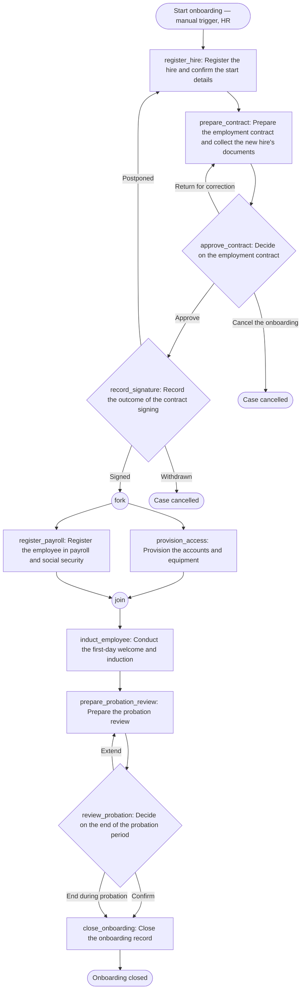

# Employee onboarding — workflow design

Produced by `provia-workflow-designer` (provia-skills 1.2.0) on 2026-09-21. Country: Angola (provisional, not supplied). Language: en. Mode: disconnected.

## What was and was not available

| Item | Status |
| --- | --- |
| Onboarding SOP text | **Not supplied.** The request named an SOP but none was attached and the working directory was empty. |
| Project manifest (`provia-project.json`) | None existed; one was created. |
| Groups, entity types, existing workflows in the tenant | **Not readable.** The Provia MCP server is listed but the `org_get_context` call was not permitted in this session, so nothing was read or written in any organization. |
| Roles, approval rules, service levels, exceptions | Not supplied. |
| Country, sector, organization name | Not supplied. |

Because the design must rest on something the reader can check line by line, the missing SOP was replaced by an **assumed outline** recorded as source `sop-onboarding-assumed` (kind `other`, sections A1–A9) in the manifest. Every row below cites those sections. Nothing in the assumed outline is a confirmed fact about the customer; it is the conventional shape of an onboarding procedure and is there to be confirmed or replaced (decision D1). No deadline, threshold, statutory obligation or approver authority was invented: where the source would normally supply one, the design leaves the value unset and records a decision.

## 1. Source step classification

| Source | Text (assumed) | Classification | Reason | Owning action |
| --- | --- | --- | --- | --- |
| A1 | HR opens the case once the hire is approved, with name, job title, department, start date and hiring manager | `intake` + `action` | Data collected at case start (manual trigger fields); confirming the approval evidence is the starter's observable work | trigger fields; `register_hire` |
| A2 | Start details confirmed with the hiring manager | `folded` | A hand-off inside the HR starter's task; the manager confirms, does not produce separate evidence | `register_hire` (How, step 2) |
| A3 | Contract drafted; identification, tax, social-security and bank documents collected from the new hire | `action` | One owner (HR), one evidence set (draft + documents). The new hire is an external party: no group, modelled as evidence | `prepare_contract` |
| A4 | HR Management approves the draft, returns it or cancels | `decision` | An authorized person chooses among outcomes | `approve_contract` |
| A5 | Contract signed; the hire may sign, postpone or withdraw | `decision` | The outcome routes the case (continue, return, cancel); arranging the appointment is folded | `record_signature` |
| A6 | IT creates accounts and prepares equipment before the start date | `action` | One owner, evidence in the case; independent of payroll → parallel | `provision_access` |
| A6 (exception) | IT informs the manager and HR when equipment is missing | `folded` | An "is informed" inside the exception path; a Notification action is a recommendation (D10) | `provision_access` (Exceptions) |
| A7 | HR registers the employee in payroll and submits statutory registrations | `action` | One owner, receipts as evidence; independent of IT → parallel. The statutory deadline is not asserted (D8) | `register_payroll` |
| A8 | Hiring manager receives the employee, hands over equipment, completes the induction checklist | `action` | Owner is the person in the `hiring_manager` field (design requirement; product cannot assign from a field) | `induct_employee` |
| A9 | Hiring manager evaluates at end of probation; confirms, extends or ends | `decision` | Authorized choice with three outcomes; the preparation of the review is HR's own work | `review_probation`, preceded by `prepare_probation_review` |
| A9 (closing) | HR closes the file | `action` | Verifies the evidence set and records the final status | `close_onboarding` |
| A9 (separation) | Employment ended during probation | `out_of_scope` | The separation is another process; the closing action records the hand-off only (D9) | `close_onboarding` (Exceptions) |

No `conflict` rows: with a single assumed source there is nothing to disagree with. Conflicts can only appear once the real SOP arrives.

## 2. Action table

Owners are group keys from `groups[]` of the manifest (all four proposed, none confirmed). `due` is unset on every action: no service level was supplied (D3).

| # | localId | Name | Type | Owner (`assigneeRef`) | Task + evidence | `due` | Source |
| --- | --- | --- | --- | --- | --- | --- | --- |
| 1 | `register_hire` | Register the hire and confirm the start details | standard, sequential | `creator` (the HR starter) | Attach the hiring approval; confirm start date, job title, department with the hiring manager. Evidence: approval attached + confirming comment. Sets `hiring_manager`, `start_date`, `job_title`, `department` | open (D3) | A1, A2 |
| 2 | `prepare_contract` | Prepare the employment contract and collect the new hire's documents | standard, sequential | `hr` | Draft contract from the template; collect admission documents; fill `probation_end_date`. Evidence: draft + documents attached | open (D3) | A3 |
| 3 | `approve_contract` | Decide on the employment contract | decision, sequential | `hr_management` | Branches: **Approve** → continue · **Return for correction** → return to `prepare_contract` (comment required) · **Cancel the onboarding** → cancel_incident (comment required) | open (D3) | A4 |
| 4 | `record_signature` | Record the outcome of the contract signing | decision, sequential | `hr` | Branches: **Signed** → continue (signed contract attached) · **Postponed** → return to `register_hire` (comment required; new date re-confirmed) · **Withdrawn** → cancel_incident (comment required) | open (D3) | A5 |
| 5 | `provision_access` | Provision the accounts and equipment | standard, **parallel** | `it_support` | Accounts, equipment; evidence: comment with accesses and serial numbers | open (D3) | A6 |
| 6 | `register_payroll` | Register the employee in payroll and social security | standard, **parallel** | `hr` | Payroll record and the registrations the organization is obliged to make; evidence: receipts + dated comment | unset; `dueInSource` legal (D8) | A7 |
| 7 | `induct_employee` | Conduct the first-day welcome and induction | standard, sequential | `field:hiring_manager`, fallback `hiring_managers` (role) | Handover, introductions, signed induction checklist | unset; `dueInSource` event_relative (first day = `start_date`) | A8 |
| 8 | `prepare_probation_review` | Prepare the probation review | standard, sequential | `hr` | Confirm/update `probation_end_date`; send the evaluation template to the manager; evidence: dated comment | unset; `dueInSource` event_relative (before `probation_end_date`, D4) | A9 |
| 9 | `review_probation` | Decide on the end of the probation period | decision, sequential | `field:hiring_manager`, fallback `hiring_managers` | Branches: **Confirm** → continue · **Extend** → return to `prepare_probation_review` (comment required; HR updates the end date) · **End during probation** → continue (comment required; closing action hands off, D9). Evidence: completed evaluation attached | unset; `dueInSource` event_relative (D4) | A9 |
| 10 | `close_onboarding` | Close the onboarding record | standard, sequential | `hr` | Verify the full evidence set; record final status and filing | open (D3) | A9 |

Exception paths that are not branches live in each action's `Exceptions:` line (missing approval, missing documents, terms differing from the approval, authority exceeded, missing equipment, registration blocked, no-show on day one, access failure, probation date already passed, manager unable to evaluate, missing document at closing).

Proposed groups (all flagged `unnamed`; details in `groups[]`): `hr` (team, area `people`), `hr_management` (team, `people`; also `single_person` and `segregation` against `hr`), `hiring_managers` (role; fallback for the `field:` assignee), `it_support` (team, `technology`). The new hire is `external` and gets no group. Unresolved entity type: `employee` (D7).

## 3. Flow diagram

## 4. YAML skeleton

`workflow.yaml` in this directory: `provia.ao/v1` `Workflow`, prefix `ONB`, one manual trigger, six fields (`employee_name`, `job_title`, `department`, `start_date`, `hiring_manager` of type `user`, `probation_end_date`), an `access` section by group name, and the ten actions with full five-part descriptions and decision branches. `assignee` is set only on `register_hire` (`creator`); the other owners are group keys in the manifest and are omitted from the YAML until the groups exist. No `due` is set.

This is a skeleton for `provia-workflow-package`, which runs `validate-workflow.mjs`. It has **not** been validated against the contract engine.

## 5. Manifest entry

Written to `provia-project.json`: `workflows[0]` (`onboarding`) with the actions above, `access` (`group:hr` → `create_incident`, `group:hr_management` → `edit`, sensitivity `internal` with a note on personal data, no grant to IT or hiring managers), `ownerArea: people`, one open manual trigger with no allowlist, `unresolvedEntityTypes: [employee]`, five `setupNotes`; four proposed `groups[]`; decisions D1–D10.

## Checks actually run

| Check | Command | Result |
| --- | --- | --- |
| Manifest check | `node scripts/build-project-map.mjs provia-project.json --check` | 0 errors, 0 warnings, 2 infos (assigned groups `it_support` and `hiring_managers` hold no grant — intended, rule 4). Access declared 1/1, 0 readiness blocks, 1 unresolved entity key, 43 pending items. |
| Project map | `… --output project.html` | Written. |
| Setup handover | `… --setup setup.md` | Written. Mode: manual configuration (no receipts). |
| Action review gate | `node scripts/review-actions.mjs workflow.yaml` | 10/10 actions have all five parts, 0 implementer-note leaks, `due` missing on 10/10 (by design). Presence check only; wording quality not certified. |
| YAML validation | `validate-workflow.mjs` | **Not run** — belongs to `provia-workflow-package`. |

The check validates the manifest's shape and references; it does not validate this Markdown file and it says nothing about business correctness.

## Confirmed facts, recommendations, unresolved

**Confirmed facts:** none about the customer. The only facts are about this session: no SOP was supplied, no tenant was read, the files listed above exist and the checks above produced the results stated.

**Recommendations (mine, not the source's):** the ten-action shape; two decision points before day one (contract approval, signature outcome) and one at the end (probation); parallel IT/payroll preparation; a Return outcome at every approval; comment required on every non-happy outcome; evidence proposed for every action; `internal` sensitivity pending D6; Notification actions for the new hire and manager (D10, `provia-automation-designer`).

**Unresolved (decisions D1–D10, owner "Process owner (HR) — to be named" unless stated):**
D1 supply or confirm the SOP · D2 real actor names and members · D3 service levels for every `due` · D4 probation length, extension rule, who decides · D5 contract approver, authority limit and delegate (Head of HR) · D6 restricted vs internal · D7 Employee entity type (implementer + owner) · D8 country/jurisdiction and statutory registrations (owner + legal counsel) · D9 which process handles separation · D10 automatic notifications.
