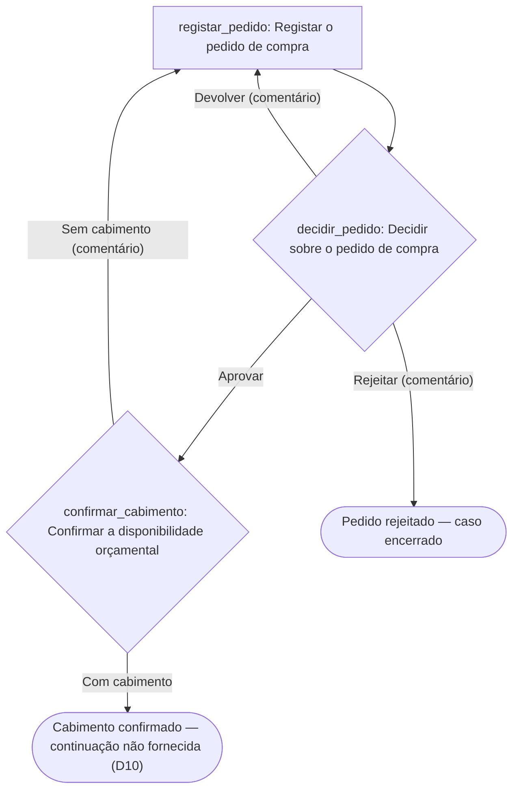

# Pedido de compra — desenho do workflow

Projecto `compras` · País: **Angola** (contexto de partida provisório, não confirmado) · Língua: pt-AO · Moeda: AOA · Fuso: Africa/Luanda
Gerado com provia-skills 1.2.1 · contrato `fed8efaf019abc901cb2b229f3676dc4031126fa` · 2026-09-23

## O que serviu de fonte

O procedimento escrito de compras **não foi fornecido**. A única fonte é a descrição verbal do pedido, registada no manifesto como `descricao-compras` (tipo `interview`):

| Secção | Texto da fonte |
| --- | --- |
| 1 | «Transforme o nosso procedimento de compras num workflow» |
| 2 | «A chefia aprova o pedido» |
| 3 | «as Finanças confirmam a disponibilidade orçamental» |

Tudo o que se segue além destas três linhas está marcado como **recomendação** ou como **decisão aberta**. Nada foi lido nem escrito na organização: o servidor MCP da Provia está listado neste ambiente, mas a leitura `org_get_context` não foi autorizada nesta sessão, pelo que o modo é `disconnected` e os grupos são propostas, não grupos existentes.

## 1. Classificação dos passos da fonte

| Fonte | Texto | Classificação | Razão | Acção |
| --- | --- | --- | --- | --- |
| `descricao-compras#1` | «o nosso procedimento de compras» | `out_of_scope` | Define o âmbito e o nome do processo; não é um passo executável. Levanta D1: o procedimento escrito não foi fornecido. | — |
| `descricao-compras#2` | «A chefia aprova o pedido» | `decision` | Uma pessoa autorizada escolhe entre desfechos. Aprovar, devolver e rejeitar são ramos nomeados. | `decidir_pedido` |
| `descricao-compras#2` | «o pedido» (existência do pedido com dados suficientes para decidir) | `action` · **recomendação** | Nenhum dos dois controlos pode correr sem objecto, justificação, montante e centro de custo. A fonte não descreve o registo; é proposto como primeira acção. | `registar_pedido` |
| `descricao-compras#2` | O requerente fica a saber a decisão | `folded` | Toma conhecimento pelo próprio caso; não é uma acção separada. Registado em `actions[].folded[]`. | `decidir_pedido` |
| `descricao-compras#3` | «as Finanças confirmam a disponibilidade orçamental» | `action` | Trabalho observável de um responsável, com evidência (a rubrica consultada). **Desenhado como Decisão** para que a situação «sem cabimento» tenha caminho de retorno — ver D9. | `confirmar_cabimento` |

Nada da fonte ficou sem linha. O que **não** existe na fonte e por isso não foi desenhado: encomenda, recepção, factura, pagamento, limites de aprovação, prazos, notificações e formulários de recolha.

## 2. Quadro das acções

| # | `localId` | Nome | Tipo | Responsável (`assigneeRef`) | Tarefa e evidência | `due` | Fonte |
| --- | --- | --- | --- | --- | --- | --- | --- |
| 1 | `registar_pedido` | Registar o pedido de compra | `standard` | `creator` (o requerente) | Descrever o bem ou serviço e reunir os dados da decisão. Evidência: `purchase_subject`, `purchase_justification`, `purchase_amount` e `cost_centre` preenchidos; proposta anexada em `supplier_quote` quando exista. | **decisão aberta (D8)** — a fonte não fixa prazos | `#2` |
| 2 | `decidir_pedido` | Decidir sobre o pedido de compra | `decision` | `chefias` *(grupo proposto)* | Decidir se o pedido avança para a confirmação orçamental. Evidência: comentário obrigatório em «Devolver» e «Rejeitar»; o desfecho registado é a evidência da aprovação. | **decisão aberta (D8)** | `#2` |
| 3 | `confirmar_cabimento` | Confirmar a disponibilidade orçamental | `decision` | `financas` *(grupo proposto)* | Confirmar se o saldo do centro de custo cobre o montante. Evidência: `budget_reference` preenchido, comprovativo do saldo anexado com data, comentário com o défice em «Sem cabimento». | **decisão aberta (D8)** | `#3` |

Ramos das decisões:

| Acção | Ramo | Desfecho | Destino | Comentário obrigatório |
| --- | --- | --- | --- | --- |
| `decidir_pedido` | Aprovar | `continue` | segue para `confirmar_cabimento` | não |
| `decidir_pedido` | Devolver | `return_to_action` | `registar_pedido` | **sim** |
| `decidir_pedido` | Rejeitar | `cancel_incident` | encerra o caso | **sim** |
| `confirmar_cabimento` | Com cabimento | `continue` | fim do desenho actual | não |
| `confirmar_cabimento` | Sem cabimento | `return_to_action` | `registar_pedido` | **sim** |

As três acções correm em sequência (`executionMode: sequential`): a decisão depende do pedido registado, e a confirmação orçamental está proposta depois da aprovação para não gastar trabalho das Finanças em pedidos que serão rejeitados. **A fonte não fixa esta ordem** («a chefia aprova **e** as Finanças confirmam») — ver D2, que inclui a alternativa em paralelo.

Devolver e «Sem cabimento» são caminhos de retorno **recomendados**: a fonte não descreve rejeição, devolução nem falta de saldo. Sem eles um pedido sem orçamento fica sem saída no caso.

### Campos do caso

| Campo | Etiqueta | Tipo | Obrigatório | Quem preenche |
| --- | --- | --- | --- | --- |
| `purchase_subject` | Bem ou serviço pedido | `text` | sim | requerente |
| `purchase_justification` | Justificação da necessidade | `rich_text` | sim | requerente |
| `purchase_amount` | Montante estimado | `currency` (AOA) | sim | requerente |
| `cost_centre` | Centro de custo | `text` | sim | requerente — passa a `select` com a lista oficial (D11) |
| `needed_by` | Necessário até | `date` | não | requerente |
| `supplier_quote` | Proposta do fornecedor | `file` | não | requerente |
| `budget_reference` | Referência do cabimento | `text` | não | Finanças |

### Grupos propostos

| `key` | Nome | Sinalizações |
| --- | --- | --- |
| `chefias` | Chefias | `unnamed` (a fonte diz «a chefia» sem dizer quem, nem se varia por departamento — D3); `segregation` (a mesma pessoa pode ser requerente e decisor — D4) |
| `financas` | Finanças | `alias` (pode ser Direcção Financeira, DAF ou Contabilidade; o Provia resolve autorizações pelo nome do grupo — D5) |

### Acesso

| Destinatário | Nível | Razão |
| --- | --- | --- |
| `organization` | `create_incident` | Proposta: qualquer colaborador abre o seu pedido. A fonte não delimita quem pode abrir — D6. |

As Chefias e as Finanças **não** recebem autorização: quem é responsável ou decisor vê os casos que transportam as suas acções. Um `view` a estas equipas só se propõe se a organização disser que acompanham todos os pedidos, e a fonte não o diz (`--check` assinala isto como informação, não como falha). Sensibilidade `internal`: a fonte não usa palavras como «confidencial» ou «restrito». O nível `edit` (dono do desenho, inclui publicar) fica sem atribuição até D7: por agora só o importador e os administradores da organização editam e publicam.

## 3. Fluxo



## 4. Esqueleto YAML

`workflow.yaml`, `apiVersion: provia.ao/v1`, prefixo `COMP`, com o gatilho manual «Iniciar pedido de compra», os sete campos, a secção `access` e as três acções com o texto completo das instruções (cinco partes: Tarefa, Como, Evidência, Concluído quando, Excepções).

É um **esqueleto para `provia-workflow-package`**: o validador (`scripts/validate-workflow.mjs`) e o portão de revisão das acções (`scripts/review-actions.mjs`) **não foram executados** neste passo. Nenhum identificador da organização foi inventado: `registar_pedido` está atribuída ao criador e as duas outras acções ficam sem `assignee` até os grupos existirem no Provia.

## 5. Entrada no manifesto

`provia-project.json` (`provia-project/v1.1`) contém a fonte `descricao-compras`, os grupos `chefias` e `financas`, o workflow `compras` com as três acções, `access`, `triggers[]`, `setupNotes[]` e as onze decisões abertas.

Verificação executada, a partir da raiz do plugin:

```
node scripts/build-project-map.mjs provia-project.json --check
```

Resultado real: **0 erros, 0 avisos, 2 informações** (as duas equipas sem autorização, que é o desenho pretendido pela regra 4), acesso declarado em 1/1 workflows, 0 bloqueios de prontidão, 0 actores ou tipos de entidade não resolvidos, **23 itens pendentes de configuração**. Isto verifica a estrutura e as referências do manifesto; não verifica o YAML nem a correcção do processo.

Também gerados: `setup.md` (a lista de configuração manual) e `project.html` (mapa do projecto, para revisão com o cliente).

## Decisões a responder antes de empacotar

| # | Pergunta | Dono |
| --- | --- | --- |
| D1 | Existe procedimento de compras escrito? Fornecê-lo: este desenho assenta em duas frases. | Quem pediu o desenho |
| D2 | A chefia decide antes das Finanças (proposto), depois, ou em paralelo? | Dono do processo |
| D3 | «A chefia» é um grupo único ou um por departamento? Qual é o limite de autoridade e quem aprova acima dele? | Dono do processo |
| D4 | Pode uma chefia decidir sobre um pedido que ela própria registou? | Dono do processo |
| D5 | Nome oficial da equipa das Finanças no Provia. | Dono do processo |
| D6 | Quem pode abrir um pedido: toda a organização ou áreas determinadas? | Dono do processo |
| D7 | Que grupo é dono do desenho (nível `edit`) e quem autoriza a publicação? | Dono do processo |
| D8 | Que prazos têm a decisão e a confirmação? Sem resposta, as acções ficam sem `due`. | Dono do processo |
| D9 | Sem cabimento, o pedido volta ao requerente (proposto) ou é encerrado? | Dono do processo |
| D10 | O que acontece depois do cabimento confirmado (encomenda, recepção, factura, pagamento)? Mesmo workflow ou outro? | Dono do processo |
| D11 | Existe lista oficial de centros de custo e categorias de compra? | Finanças |

A prontidão para publicação é decidida na Provia por uma pessoa autorizada. Validade estrutural não é correcção de negócio.
