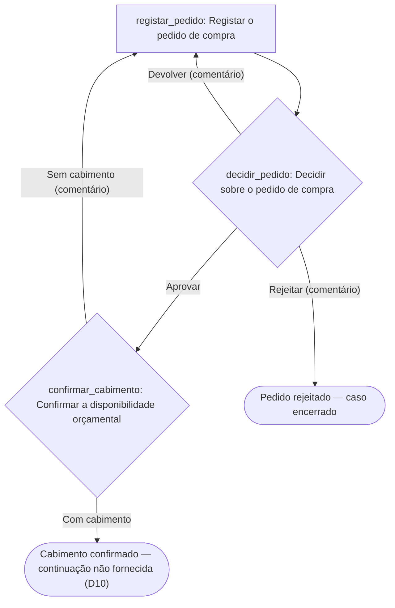

Desenho concluído. Ficheiros escritos em `workflow-designer-normal/`: `workflow.yaml`, `provia-project.json`, `design-compras.md`, `setup.md`, `project.html`.

**Antes de tudo:** o procedimento escrito de compras não foi fornecido — a pasta de trabalho estava vazia. A única fonte são as duas regras que enunciou, registadas no manifesto como fonte do tipo `interview`. O desenho cobre-as por inteiro; tudo o mais está marcado como recomendação ou decisão aberta. O servidor MCP da Provia aparece listado neste ambiente, mas a leitura `org_get_context` não foi autorizada nesta sessão (sessão não interactiva): o modo é `disconnected`, nada foi lido nem escrito na organização, e os grupos abaixo são propostas.

## 1. Classificação dos passos da fonte

| Fonte | Texto | Classificação | Acção |
| --- | --- | --- | --- |
| `#1` | «o nosso procedimento de compras» | `out_of_scope` — define âmbito, não é passo; levanta D1 | — |
| `#2` | «A chefia aprova o pedido» | `decision` | `decidir_pedido` |
| `#2` | existência do pedido com dados para decidir | `action` · **recomendação** (nenhum controlo corre sem ele) | `registar_pedido` |
| `#2` | o requerente sabe a decisão | `folded` no próprio caso | `decidir_pedido` |
| `#3` | «as Finanças confirmam a disponibilidade orçamental» | `action`, desenhada como Decisão para dar saída a «sem cabimento» (D9) | `confirmar_cabimento` |

## 2. Acções

| # | `localId` | Nome | Tipo | Responsável | Evidência | `due` |
| --- | --- | --- | --- | --- | --- | --- |
| 1 | `registar_pedido` | Registar o pedido de compra | `standard` | `creator` | objecto, justificação, montante e centro de custo preenchidos; proposta anexada | **aberto (D8)** |
| 2 | `decidir_pedido` | Decidir sobre o pedido de compra | `decision` | `chefias` *(proposto)* | comentário obrigatório em «Devolver» e «Rejeitar» | **aberto (D8)** |
| 3 | `confirmar_cabimento` | Confirmar a disponibilidade orçamental | `decision` | `financas` *(proposto)* | `budget_reference`, comprovativo do saldo com data, comentário do défice | **aberto (D8)** |

Ramos: Aprovar → `continue`; Devolver → `return_to_action: registar_pedido`; Rejeitar → `cancel_incident`; Com cabimento → `continue`; Sem cabimento → `return_to_action: registar_pedido`. Não inventei prazos — a fonte não fixa nenhum, por isso `due` fica vazio e vai a decisão.

## 3. Fluxo



## 4. YAML e 5. manifesto

`workflow.yaml` (`provia.ao/v1`, prefixo `COMP`) traz o gatilho manual, sete campos (`purchase_subject`, `purchase_justification`, `purchase_amount` em AOA, `cost_centre`, `needed_by`, `supplier_quote`, `budget_reference`), a secção `access` e o texto completo das cinco partes em cada acção. É um esqueleto para `provia-workflow-package`: **o validador e o portão de revisão das acções não foram executados**. Nenhum ID da organização foi inventado — as duas acções de grupo ficam sem `assignee`.

Acesso: `organization` → `create_incident` (proposta, D6); sensibilidade `internal`; Chefias e Finanças **sem** concessão, porque vêem os casos que transportam as suas acções; o nível `edit` fica sem dono até D7.

Verificação que corri de facto — `node scripts/build-project-map.mjs provia-project.json --check`: **0 erros, 0 avisos, 2 informações** (as duas equipas sem concessão, que é o desenho pretendido pela regra 4), acesso declarado em 1/1, 0 bloqueios de prontidão, **23 itens pendentes de configuração**. Verifica a estrutura e as referências do manifesto — não o YAML nem a correcção do processo.

## Decisões abertas (11, todas em `provia-project.json` e em `setup.md`)

As que mais alteram o desenho: **D1** fornecer o procedimento escrito; **D2** a ordem chefia/Finanças (a fonte diz «e», não «depois»; propus sequencial para não gastar trabalho das Finanças em pedidos que serão rejeitados, a alternativa é paralelo); **D3** «a chefia» é um grupo ou um por departamento, e qual o limite de autoridade; **D8** prazos; **D10** o que acontece depois do cabimento (encomenda, recepção, factura, pagamento não constam da fonte, por isso o workflow termina na confirmação).

Próximo passo recomendado: `provia-organization-rollout`, para fechar os grupos `chefias` e `financas` (nome oficial, membros, segregação) — sem eles as duas acções não têm responsável configurável e o pacote fica incompleto. Se preferir validar primeiro a estrutura, use `provia-workflow-package`.

```text
Use provia-organization-rollout com o provia-project.json e o workflow.yaml desta pasta. Complete os grupos chefias e financas (nome oficial no Provia, membros, área, segregação requerente/decisor) e responda a D3, D4, D5 e D7. Preserve as responsabilidades desenhadas. País: Angola; responda em pt-AO.
```