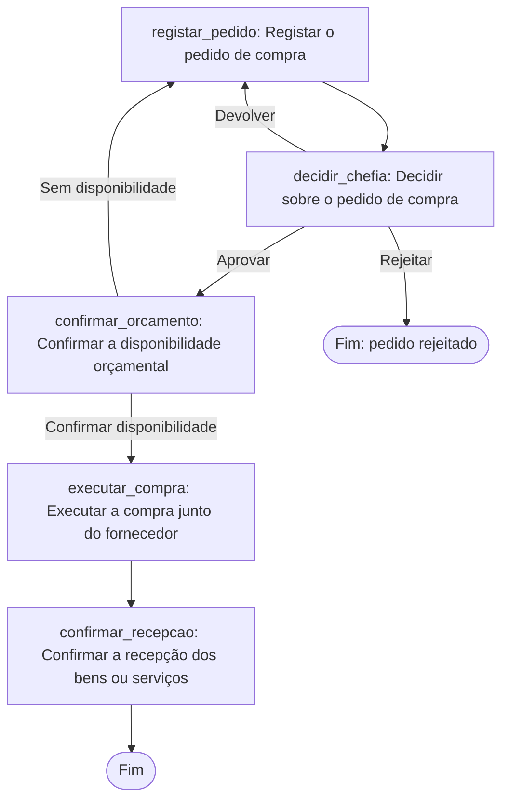

Tudo consistente. Aqui está o desenho completo.

**Suposição declarada:** o pedido não indicou país nem documento-fonte, por isso assumi Angola/pt‑AO/AOA/Africa‑Luanda a título provisório (D7) e completei o procedimento com dois passos típicos de PME (execução da compra e confirmação de recepção) que **não** vêm do seu pedido — estão marcados como suposição em `executar_compra`, `confirmar_recepcao` e no grupo `compras` (D5). O núcleo pedido — registo, aprovação da chefia, confirmação orçamental das Finanças — está classificado directamente a partir da sua frase.

## 1. Classificação dos passos-fonte

Fonte: `pedido-utilizador`, §1 — "Transforme o nosso procedimento de compras num workflow. A chefia aprova o pedido e as Finanças confirmam a disponibilidade orçamental."

| Texto | Classificação | Motivo | Acção |
| --- | --- | --- | --- |
| "pedido de compra" (implícito) | `intake` | Dados recolhidos antes de existir o caso | `registar_pedido` |
| "A chefia aprova o pedido" | `decision` | Pessoa autorizada escolhe entre avançar/rejeitar/devolver | `decidir_chefia` |
| "as Finanças confirmam a disponibilidade orçamental" | `decision` | Pessoa autorizada confirma cabimento; sem regra automática | `confirmar_orcamento` |

**Recomendações (fora da frase-fonte, suposição de PME típica):** `executar_compra` e `confirmar_recepcao`, com o grupo `compras`.

## 2. Tabela de acções

| localId | Nome | Tipo | Responsável | Tarefa + evidência | `due` | Fonte |
| --- | --- | --- | --- | --- | --- | --- |
| `registar_pedido` | Registar o pedido de compra | standard | `creator` | Descrever a necessidade e submeter; evidência: descrição, montante, centro de custo | decisão aberta (D4) | §1 |
| `decidir_chefia` | Decidir sobre o pedido de compra | decision | `chefias` | Aprovar/Devolver/Rejeitar; comentário obrigatório em Devolver/Rejeitar | decisão aberta (D4) | §1 |
| `confirmar_orcamento` | Confirmar a disponibilidade orçamental | decision | `financas` | Confirmar disponibilidade/Sem disponibilidade; referência orçamental ou comentário | decisão aberta (D4) | §1 |
| `executar_compra` | Executar a compra junto do fornecedor | standard | `compras` (proposto) | Emitir encomenda; evidência: nota + referência | decisão aberta (D4) | recomendação |
| `confirmar_recepcao` | Confirmar a recepção dos bens ou serviços | standard | `creator` | Verificar conformidade; evidência: documento de recepção | decisão aberta (D4) | recomendação |

## 3. Fluxo



## 4. YAML skeleton

Escrito em `workflow.yaml` (esqueleto para `provia-workflow-package`, que executa o validador — não afirmo que foi validado estruturalmente). Descrições completas de cinco partes em cada acção; `assignee` omitido para `chefias`/`financas`/`compras` porque são grupos ainda não resolvidos — a intenção fica no `assigneeRef` do manifesto.

## 5. Manifesto do projecto

Escrito em `provia-project.json`. `node scripts/build-project-map.mjs provia-project.json --check` correu sem erros e sem avisos (`0 warnings`). Também gerei `project.html` (mapa) e `setup.md` (entrega de configuração) a partir do manifesto.

## Decisões em aberto (responder antes de empacotar)

- **D1** Quem integra o grupo «Chefias de departamento»?
- **D2** Existe um limiar de valor que sobe a aprovação a uma autoridade superior à chefia?
- **D3** Sem disponibilidade orçamental, o pedido volta ao requerente (assumido) ou é decidido pela chefia?
- **D4** Prazos (SLA) de cada etapa — nenhum foi indicado, por isso `due` ficou em aberto em todas as acções.
- **D5** `executar_compra`/`confirmar_recepcao`/grupo `compras` são suposição de PME — ficam neste workflow, num workflow separado, ou saem?
- **D6** Designação oficial do grupo «Finanças» (Finanças / Direcção Financeira / Contabilidade / DAF)?
- **D7** País/jurisdição real — foi assumido Angola a título provisório.

---

Próximo passo recomendado: **`provia-organization-rollout`**, para transformar os grupos propostos (`chefias`, `financas`, `compras`) em donos reais, resolver as sinalizações (`alias`, `unnamed`) e responder a D1/D6 antes de avançar para YAML final.

```text
Use provia-organization-rollout com o manifesto provia-project.json deste projecto (workflow "compras"). Complete os grupos «chefias», «financas» e «compras», resolva as sinalizações de alias e de responsável sem nome, e proponha o plano de adopção. País: Angola (provisório, confirmar); responda em pt-AO.
```