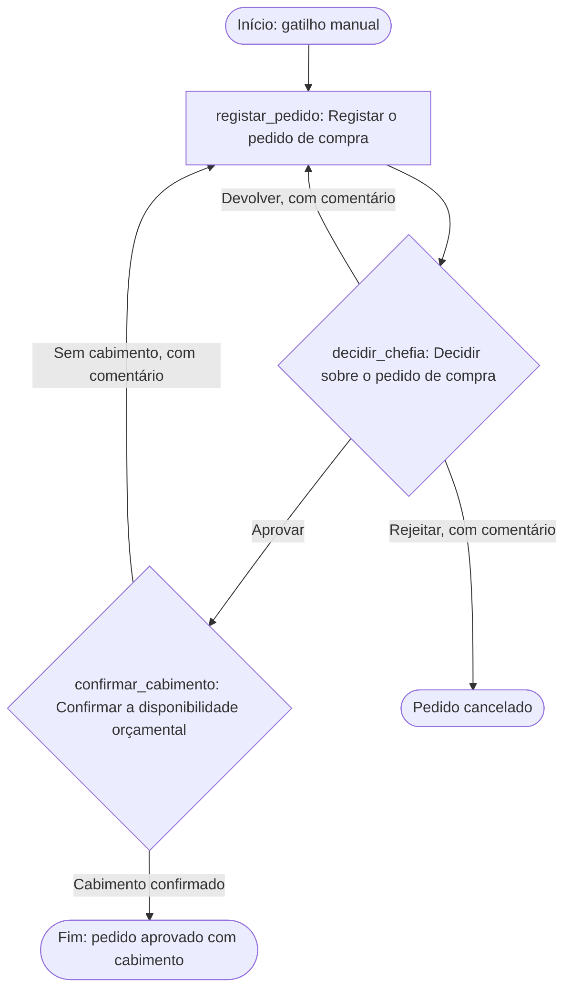

# Desenho do workflow «Pedido de compra»

Gerado por `provia-workflow-designer` (provia-skills 1.2.0) em 2026-09-21. Contexto provisório: Angola, pt-AO, AOA/Kz, Africa/Luanda, porque nenhum país foi indicado. Modo desligado: a leitura do tenant (`org_get_context`) não foi autorizada nesta sessão, por isso nada foi lido nem criado em Provia.

## Fonte

Única fonte fornecida (`pedido-compras-2026-09-21`, tipo entrevista): a frase «Transforme o nosso procedimento de compras num workflow. A chefia aprova o pedido e as Finanças confirmam a disponibilidade orçamental.» O procedimento escrito não foi entregue; tudo o que vai além desta frase está marcado como **pressuposto** ou **recomendação** e tem uma decisão aberta (D1–D10).

## 1. Classificação dos passos da fonte

| Id | Secção | Texto da fonte | Classificação | Motivo | Acção |
| --- | --- | --- | --- | --- | --- |
| S0 | frase 1 | «Transforme o nosso procedimento de compras num workflow» | `out_of_scope` | Delimita o âmbito; o documento do procedimento não foi fornecido, logo os passos que ele possa conter não estão aqui (D8). | (nenhuma) |
| S1 | implícito | «procedimento de compras» → alguém apresenta um pedido | `action` | Sem pedido registado não há nada para a chefia aprovar. Dados recolhidos pelo requerente (`creator`). Recomendação: converter em formulário de entrada com `provia-form-designer` quando os campos forem confirmados (D10). | `registar_pedido` |
| S2 | frase 2 | «A chefia aprova o pedido» | `decision` | Uma pessoa autorizada escolhe entre resultados. A fonte só nomeia «aprova»; os ramos «Devolver» e «Rejeitar» são recomendação para não deixar o caso sem saída. | `decidir_chefia` |
| S2a | lacuna | (rejeição / devolução pela chefia, não descrita) | `folded` | Caminho de retorno modelado como ramo da decisão com destino `registar_pedido`; o requerente corrige na sua própria acção. | `registar_pedido` (folded) |
| S3 | frase 2 | «as Finanças confirmam a disponibilidade orçamental» | `decision` | A confirmação tem dois resultados observáveis (há / não há cabimento) e o segundo precisa de um destino; por isso é Decisão e não acção Standard. | `confirmar_cabimento` |
| S3a | lacuna | (sem cabimento, não descrito) | `folded` | Recomendação: ramo «Sem cabimento» devolve a `registar_pedido` com comentário (D3). | `registar_pedido` (folded) |
| S3b | lacuna | (o que se segue à confirmação, não descrito) | `out_of_scope` | Execução da compra, adjudicação, recepção e pagamento não constam da fonte; o workflow termina no cabimento confirmado (D5). | (nenhuma) |

Nada da fonte ficou sem linha. Não há conflitos entre secções (só existe uma fonte).

## 2. Tabela de acções

| localId | Nome | Tipo | assigneeRef | Tarefa + evidência | due | sourceRefs |
| --- | --- | --- | --- | --- | --- | --- |
| `registar_pedido` | Registar o pedido de compra | Standard | `creator` | Registar necessidade, montante em Kz, centro de custo, justificação; anexar proposta se existir. Evidência: campos `purchase_description`, `purchase_amount`, `cost_centre`, `purchase_justification` preenchidos. | não definido (D4) | S1 |
| `decidir_chefia` | Decidir sobre o pedido de compra | Decision | `chefias` (grupo proposto) | Decidir se o pedido avança. Ramos: **Aprovar** → `continue`; **Devolver** → `return_to_action: registar_pedido` (comentário obrigatório); **Rejeitar** → `cancel_incident` (comentário obrigatório). Evidência: decisão registada com comentário nos ramos negativos. | não definido (D4) | S2 |
| `confirmar_cabimento` | Confirmar a disponibilidade orçamental | Decision | `financas` (grupo proposto) | Verificar o saldo da rubrica e registar `budget_reference`. Ramos: **Cabimento confirmado** → `continue`; **Sem cabimento** → `return_to_action: registar_pedido` (comentário obrigatório). Evidência: `budget_reference` + captura/extracto do saldo com data; comentário com o défice. | não definido (D4) | S3 |

Ordem: sequencial (S1 → S2 → S3), assumida pela ordem da frase (D1). Não há trabalho independente que justifique execução paralela. Nenhum limite de montante foi codificado (D9); a autoridade é exercida pela chefia na Decisão, não por um campo numérico.

Campos do workflow (todos recomendação, excepto o montante que a confirmação orçamental exige): `purchase_description` (text, obrigatório), `purchase_amount` (currency AOA, obrigatório), `cost_centre` (text, obrigatório), `purchase_justification` (rich_text, obrigatório), `supplier_quotation` (file, opcional), `budget_reference` (text, preenchido pelas Finanças).

### Grupos propostos (a completar por `provia-organization-rollout`)

| key | name | kind | flags | Motivo |
| --- | --- | --- | --- | --- |
| `chefias` | Chefias | team | `unnamed`, `segregation` | «A chefia» não diz o nível nem como se escolhe a chefia certa (D2); uma chefia pode pedir para si (D7). |
| `financas` | Finanças | team | (nenhum) | Confirma o cabimento (S3). |

O requerente é `creator`; não se cria grupo.

### Acesso

- `organization` → `create_incident` (pressuposto: qualquer colaborador abre um pedido; D6).
- Chefias e Finanças **sem** concessão: vêem os casos que lhes chegam pelas suas acções (regra 4). A fonte não diz que alguma área acompanha todos os pedidos.
- `edit` por atribuir: a fonte não nomeia o dono do procedimento (D8). `ownerArea` fica nulo pela mesma razão.
- `sensitivity: internal`, porque a fonte não usa palavras de confidencialidade.
- Gatilho manual «Iniciar pedido de compra» sem lista de permitidos: a fonte não restringe quem inicia abaixo dos titulares de `create_incident`.

## 3. Fluxo

## 4. Esqueleto YAML

`workflow.yaml` neste directório: `provia.ao/v1`, gatilho manual, seis campos, três acções com a descrição em cinco partes (Tarefa, Como, Evidência, Concluído quando, Excepções), `config.branches` nas duas decisões e a secção `access` emitida a partir do manifesto. Os responsáveis de grupo (`chefias`, `financas`) **não** constam do YAML, porque o contrato exige identificadores de destino que ainda não existem; o manifesto guarda a intenção em `assigneeRef`. **Não foi validado**: a validação (`scripts/validate-workflow.mjs`) e a revisão das descrições (`scripts/review-actions.mjs`) pertencem a `provia-workflow-package`.

## 5. Manifesto

`provia-project.json` criado (não existia): fonte, dois grupos propostos, o workflow `pedido_compra` com acções, `access`, gatilho e `setupNotes`, e as decisões D1–D10. `project.html` renderizado a partir dele.

Resultado real de `node scripts/build-project-map.mjs provia-project.json --check`: **0 erros, 0 avisos, 2 informações** (regra 4: `chefias` e `financas` sem concessão, comportamento pretendido); 1 workflow com acesso declarado, 0 bloqueios de prontidão, 0 actores/entidades por resolver, 21 itens pendentes (membros dos grupos, atribuições, decisões abertas). Esta verificação cobre o manifesto e a coerência com `workflow.yaml` (ids e prefixo); não valida o YAML contra o contrato do produto nem certifica correcção de negócio.

## O que foi verificado, o que está pendente

- Verificado: estrutura do manifesto, referências de grupos e fontes, regras de acesso, correspondência entre `localId` e os `id` do YAML.
- Pendente: validação do YAML (package), membros e identificadores dos grupos, prazos, e as dez decisões abaixo.
- Não feito: nada foi lido ou escrito em Provia; nenhuma publicação.

## Decisões abertas antes de empacotar

| Id | Pergunta | Dono |
| --- | --- | --- |
| D1 | A ordem chefia → Finanças é sequencial, ou Finanças primeiro / em paralelo? | Dono do procedimento |
| D2 | Quem é «a chefia» e como se escolhe a certa em cada pedido; quem substitui em ausência? | Dono do procedimento |
| D3 | Sem cabimento: devolver ao requerente (proposto), devolver à chefia, ou cancelar? | Finanças |
| D4 | Prazos de cada passo (nenhum `due` definido). | Dono do procedimento |
| D5 | O que se segue ao cabimento confirmado e o que encerra o caso? | Dono do procedimento |
| D6 | Quem pode abrir um pedido (assumido: toda a organização)? | Dono do procedimento |
| D7 | Quem aprova quando o requerente é uma chefia? | Dono do procedimento |
| D8 | Quem é o dono do procedimento (`edit`, `ownerArea`) e onde está o documento escrito? | Direcção |
| D9 | Há limites de montante ou categorias com outra autoridade? | Dono do procedimento |
| D10 | Os campos propostos (centro de custo, proposta do fornecedor) são os certos? | Finanças |
